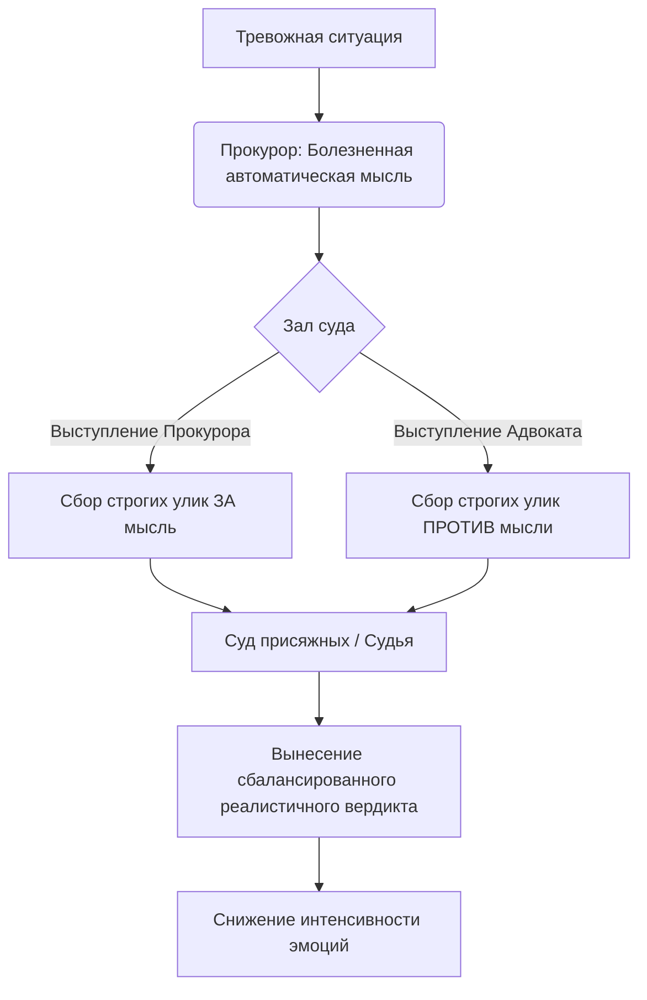

В моменты сильной тревоги, неудач или грусти наш разум часто превращается в безжалостного обвинителя. Мы начинаем верить каждой своей негативной мысли так, словно это непререкаемый факт, не требующий доказательств. Этот внутренний критик подсвечивает только наши ошибки («Ты неудачник», «Это полностью твоя вина»), игнорируя любые достижения или смягчающие обстоятельства.

Техника «Прокурор и адвокат» — это мощный инструмент самопомощи, который помогает остановить этот процесс самобичевания. Перенося свои мысли в воображаемый зал суда, вы учитесь дистанцироваться от сиюминутных эмоций и рассматривать ситуацию объективно, предоставляя себе право на справедливую защиту.

## Защита от обвинений: Суть и практическая польза

Техника «Прокурор и адвокат» (или метафора судебного слушания) — это метод **когнитивной реструктуризации** (процесса изменения болезненного, нереалистичного мышления на более сбалансированное), при котором человек рассматривает свои негативные убеждения через призму юридического процесса *(Добсон и Добсон, 2021)*.

Ее немедленная польза заключается в создании психологической дистанции и решении проблемы слепой веры в свои страхи. Находясь в состоянии тревоги, защищать себя напрямую бывает крайне сложно *(Cully et al., 2020)*. Однако людям гораздо проще вообразить себя профессиональным юристом, задача которого — найти логические нестыковки в обвинении и защитить своего «клиента» *(Лихи, 2020)*. Метод заставляет относиться к пугающей мысли не как к факту, а как к гипотезе, которую еще нужно доказать, что моментально снижает градус эмоционального напряжения.

## Судебный процесс в уме: Три ключевых участника

Механика этого упражнения строится на поочередном исполнении трех функциональных ролей для оценки одной конкретной болезненной мысли *(Myles & Shafran, 2015)*:

1.  **Прокурор (Обвинение):** Олицетворяет ваши **автоматические мысли** (быстрые, спонтанные оценки ситуации, часто имеющие негативный окрас). Его задача — безапелляционно заявлять о вашей вине и искать факты, подтверждающие худшие опасения *(Лихи, 2020)*.
2.  **Адвокат (Защита):** Рациональная часть вашего разума. Он прикладывает массу усилий, ищет реальные факты, противоречащие обвинению, находит логические ошибки прокурора и вызывает свидетелей в вашу пользу *(Лихи, 2020)*.
3.  **Присяжные / Судья:** Объективная инстанция, которая выслушивает обе стороны и выносит взвешенный вердикт только на основе твердых улик, а не эмоций *(Лихи, 2020)*.

**Механика работы (Под капотом):** Когда прокурор выносит обвинение, активируются когнитивные искажения. Переход в позицию юриста-защитника искусственно активирует префронтальную кору мозга (зону логики). Вы оцениваете мысль так, как если бы она была на скамье подсудимых, и ищете только те доказательства, которые можно реально подтвердить в материальном мире *(Cully et al., 2020)*.

## Ментальные модели и границы: Строгий судья

**Аналогия (Односторонний суд):** Представьте себе судебный процесс, на котором присутствует только сторона обвинения. Прокурор часами рассказывает о преступлениях подсудимого, а адвоката в зале просто нет. Очевидно, что суд вынесет обвинительный приговор, даже если факты притянуты за уши. В состоянии стресса вы устраиваете себе именно такой суд. Техника вводит в этот процесс защитника, восстанавливая баланс сил *(Добсон и Добсон, 2021)*. При этом Судья предельно строг: если прокурор скажет «Я нутром чую, что он виновен», судья отклонит аргумент. В суде эмоции не являются уликами.

**Чем это не является:** Важно отличать внутреннюю адвокатуру от токсичного позитива и поиска оправданий.

| Эмоциональное обоснование (Ошибка) | Объективная защита (Правильно) |
| :--- | :--- |
| **Токсичный позитив:** «Я идеален, у меня нет недостатков». | **Опора на факты:** «Я ошибся сейчас, но в прошлом я трижды успешно решал подобные задачи». |
| **Поиск оправданий:** Отказ брать ответственность, перекладывание вины на других *(Лихи, 2020)*. | **Снятие избыточной вины:** Адвокат показывает, что на ситуацию повлияли многие факторы, а не только вы *(Лихи, 2020)*. |
| **Эмоции как улика:** «Я чувствую себя неудачником». | **Факты как улика:** «Я не сдал этот конкретный экзамен с первой попытки». |

## Практическое руководство: Как выиграть дело у самого себя

Рассмотрим применение техники на реальных примерах:

*   **Ситуация — Действие — Результат (Я неудачник):** Пациент Том считает себя ни на что не способным.
    *   *Действие:* Терапевт предлагает ролевую игру. Прокурор: «Том — неудачник». Адвокат: «Неправда. Он окончил колледж, начальник его хвалит». Прокурор: «Но я *чувствую*, что он неудачник». Адвокат: «Чувства нельзя использовать как доказательства» *(Лихи, 2020)*.
    *   *Результат:* Том осознает отсутствие реальной доказательной базы у своих негативных мыслей и успокаивается.
*   **Ситуация — Действие — Результат (Рабочий стресс):** Сотрудница совершила ошибку в расчетах и боится увольнения.
    *   *Действие:* Прокурор: «Ошибка есть, босс ее заметил». Адвокат: «За 5 лет это первая ошибка. Я сразу все исправила. Увольнение маловероятно» *(Cully et al., 2020)*. Судья выносит вердикт: «Я допустила ошибку, но моя история показывает, что я хороший специалист» *(Cully et al., 2020)*.
    *   *Результат:* Переход от паники к конструктивному плану действий.

**Пошаговый алгоритм внедрения:**
1. **Зафиксируйте обвинение:** Запишите мысль, которая вас атакует, и оцените веру в нее от 0 до 100% *(Cully et al., 2020)*.
2. **Дайте слово Прокурору:** Запишите все объективные факты, подтверждающие эту мысль.
3. **Наденьте костюм Адвоката:** Дистанцируйтесь от эмоций. Заявите протест логическим ошибкам обвинения и выпишите минимум 3-4 реальных факта, противоречащих мысли. Если это сложно, спросите себя: «Что бы я сказал другу в такой ситуации?» *(Cully et al., 2020)*.
4. **Огласите вердикт Судьи:** Синтезируйте аргументы обеих сторон в одну новую, взвешенную мысль и снова оцените свои эмоции *(Myles & Shafran, 2015)*.

*Главный подводный камень:* Пациенты часто говорят: «Я не могу защищать себя, потому что я не верю в свою невиновность». Ошибка здесь в том, что адвокату *не нужно* верить в невиновность клиента, чтобы хорошо выполнять работу; ему нужно просто найти факты *(Лихи, 2020)*. Способность занимать позицию защиты, даже сомневаясь в ней — признак хорошего юриста *(Лихи, 2020)*.

## Дисциплина анализа ради эмоциональной свободы

Внедрение навыка юридического оспаривания собственных мыслей требует значительной доли самодисциплины. В моменты сильного стресса наш мозг всегда стремится пойти по пути наименьшего сопротивления — поддаться панике или привычной самокритике. Требуется волевое усилие, чтобы буквально заставить себя взять ручку, бумагу и начать скрупулезно, подобно въедливому юристу, выстраивать линию защиты, опираясь исключительно на логику.

Однако эти регулярные вложения времени приносят фундаментальные плоды. Овладение искусством внутренней адвокатуры дарит колоссальное облегчение. По мере того как вы тренируете свой разум не принимать болезненные допущения за истину в последней инстанции, ваш внутренний диалог из постоянного самобичевания превращается во взвешенную дискуссию. Вы перестаете быть беззащитной жертвой собственного разума, и процесс взвешивания фактов становится автоматической привычкой, возвращая вам способность действовать эффективно в любых обстоятельствах.

## Главный вывод и литература

> Техника «Прокурор и адвокат» — это ваш внутренний фильтр правды. Она учит вас не доверять слепо своим страхам, а проверять их на прочность с помощью железобетонных фактов, позволяя находить спокойствие в объективной реальности.

**Источники:**
* *Добсон, Д., & Добсон, К. (2021). Научно-обоснованная практика в когнитивно-поведенческой терапии. Питер.*
* *Лихи, Р. (2020). Техники когнитивной психотерапии. Питер.*
* *Cully, J. A., Dawson, D. B., Hamer, J., & Tharp, A. L. (2020). A Provider’s Guide to Brief Cognitive Behavioral Therapy. Department of Veterans Affairs South Central MIRECC.*
* *Myles, P., & Shafran, R. (2015). The CBT handbook: A comprehensive guide to using CBT to overcome depression, anxiety and anger. Robinson.*
* *Think CBT. (n.d.). Cognitive Behavioural Therapy Worksheets and Exercises.*

---

### Проверка понимания (Микро-кейс)

**Ситуация:** Ирина считает, что провалила важное собеседование, и записала автоматическую мысль: «Я никогда не получу хорошую работу». Выполняя технику «Прокурор и адвокат», в колонке Адвоката (доказательства ПРОТИВ негативной мысли) она написала: *«Я чувствую, что рекрутер мог просто устать, и в глубине души я знаю, что я умная и однажды мне повезет»*.

**Вопрос:** Какую грубую ошибку допустила Ирина при сборе доказательств для защиты, и какие аргументы ей следовало бы использовать вместо этого, чтобы соблюсти правила техники (опору на факты, принимаемые в суде)?
