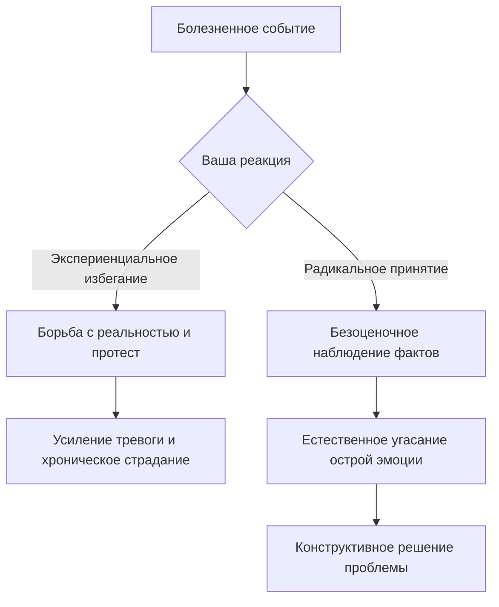

Мы все сталкиваемся с ситуациями, которые кажутся глубоко несправедливыми, болезненными и абсолютно неподконтрольными: потеря работы, расставание с близким человеком, внезапная болезнь. Наш первый, совершенно естественный инстинкт — начать сопротивляться. Мы мысленно кричим «Этого не должно было случиться!» и тратим колоссальные объемы энергии на попытки отменить прошлое или оспорить свершившиеся факты. Однако этот внутренний протест не меняет реальности, а лишь усиливает боль, загоняя нас в ловушку бесконечных страданий.

Чтобы разорвать этот замкнутый круг, в современной психотерапии используется инструмент, который учит не воевать с реальностью, а осознанно признавать ее. Этот метод помогает сберечь внутренние ресурсы, чтобы направить их не на бесплодные сожаления, а на построение осмысленной жизни даже в самых трудных обстоятельствах.

## Безоценочный взгляд на факты: Определение и назначение

**Радикальное принятие** (безоценочное и полное согласие с тем, что реальность такова, какова она есть в данный момент, без попыток ее отрицать или контролировать) — это фундаментальный навык, активно используемый в диалектической поведенческой терапии (ДПТ) и терапии принятия и ответственности (АСТ) *(Hayes et al., 2012)*. Оно подразумевает способность смотреть на происходящее напрямую, не искажая факты сквозь призму тревоги, гнева или требований о том, как «должно было быть» *(Лихи, 2018)*.

Главная практическая задача этого инструмента — предоставить человеку твердую точку опоры для решения реальных проблем *(Лихи, 2018)*. Отказываясь от истощающего протеста против того, что *уже* произошло, вы предотвращаете превращение естественной жизненной боли в хроническое и невыносимое страдание. Вы начинаете работать с тем, что есть, а не с тем, о чем мечтаете.

## Три опоры и механика: Как работает прекращение борьбы

Архитектура радикального принятия строится на трех ключевых элементах:

1. **Признание фактов:** Вы честно и объективно констатируете происходящее, не отворачиваясь от него (например, «Я одинок», «Я потерял деньги») *(Лихи, 2018)*.
2. **Отказ от контроля над неподвластным:** Вы осознаете границы своих возможностей и прекращаете попытки управлять тем, что находится вне вашей власти, включая прошлое и реакции других людей *(Лихи, 2018)*.
3. **Готовность к дискомфорту:** Вы позволяете себе в полной мере испытывать возникающие тяжелые эмоции (грусть, гнев, страх), не пытаясь их немедленно подавить или убежать от них *(Хэррис, 2022)*.

**Механика работы (Под капотом):** Сталкиваясь с травмирующим событием, наш мозг часто прибегает к **экспериенциальному избеганию** (попыткам любой ценой избавиться от нежелательных внутренних переживаний, пугающих мыслей или телесных ощущений) *(Хэррис, 2022)*. Это избегание действует как усилитель: чем больше мы боремся со страхом или грустью, тем сильнее они становятся. Радикальное принятие меняет этот механизм, работая по принципу «прекращения борьбы» *(Хэррис, 2022)*. Когда вы сознательно разрешаете боли существовать, не сопротивляясь ей, мозг перестает воспринимать ваши собственные эмоции как смертельную угрозу. Физиологическое напряжение спадает, и вы получаете доступ к аналитической части мышления, чтобы спланировать адаптивные действия *(Лихи, 2020)*.

## Точка отсчета на карте: Аналогии и границы метода

**Аналогия (Сломанный навигатор):** Представьте, что вы заблудились в лесу и смотрите в навигатор. Чтобы проложить маршрут домой, устройству необходимо сначала определить вашу точную геолокацию. Если вы находитесь в холодном болоте, но отказываетесь это признавать, крича: «Я не должен здесь быть! Я хочу быть на пляже!», вы никогда не сможете выбраться. Радикальное принятие — это просто постановка точки «Вы находитесь здесь» на карте вашей жизни *(Лихи, 2020)*. Это признание факта «Я в болоте», которое является началом пути к спасению, а не его концом.

**Чем это не является:** Самое частое заблуждение заключается в том, что согласие с реальностью приравнивают к слабости, покорности или одобрению происходящего.

| Пассивное смирение / Одобрение (Ошибка) | Радикальное принятие (Здоровый подход) |
| :--- | :--- |
| **Одобрение:** Вы считаете, что ситуация нормальна, справедлива и так и должно быть *(ДиДжузеппе и др., 2021)*. | **Признание:** Вы констатируете факты, даже если ситуация глубоко несправедлива и ужасна. Вы можете ненавидеть ее, но принимать факт ее существования *(Лихи, 2018)*. |
| **Капитуляция:** Вы опускаете руки, верите, что ничего нельзя сделать, и остаетесь жертвой *(Добсон & Добсон, 2021)*. | **Основа для действий:** Осознание реальности не означает согласия оставаться в ней. Это принятие стартовой точки для того, чтобы начать ее менять *(Barlow et al., 2011)*. |

## От протеста к действию: Практическое руководство

Рассмотрим, как этот навык работает на практике:

*   **Ситуация — Действие — Результат (Работа с импульсами):** Пациентка страдает от трихотилломании (непреодолимой тяги вырывать волосы). Ранее она боролась с желанием, злилась на себя и в итоге срывалась.
    *   *Действие:* Она учится применять радикальное принятие: признает наличие сильного позыва и позволяет желанию просто быть, *не действуя* в соответствии с ним *(Lee et al., 2020)*.
    *   *Результат:* Со временем тяга теряет свою власть, и частота эпизодов снижается.
*   **Ситуация — Действие — Результат (Депрессия и расставание):** Клиент тяжело переживает разрыв отношений, застряв в мыслях: «Она не должна была так поступать».
    *   *Действие:* Он практикует фокус на настоящем моменте и признает: «Отношения закончены. Мне очень больно. Это то, с чего я должен начать» *(Лихи, 2018)*.
    *   *Результат:* Перестав тратить силы на переписывание прошлого, он начинает оплакивать потерю и постепенно восстанавливает свою жизнь, концентрируясь на встречах с друзьями *(Bentley et al., 2021)*.

**Алгоритм внедрения:**
1. **Зафиксируйте протест:** Обратите внимание на моменты, когда вы мысленно боретесь с реальностью (используете слова «несправедливо», «за что мне это», «этого не может быть»).
2. **Назовите факты безоценочно:** Опишите ситуацию только через объективные факты, исключив суждения и оценки *(Лихи, 2020)*. (Например: «Я допустил ошибку в отчете», а не «Я никчемный идиот»).
3. **Обратитесь к телу:** Расслабьте мышцы, снимите напряжение в плечах и лице. Физическое сопротивление всегда поддерживает психологическое.
4. **Дайте место эмоциям:** Разрешите себе испытывать печаль, гнев или страх. Наблюдайте за ними, не пытаясь их подавить *(Лихи, 2020)*.
5. **Действуйте, опираясь на факты:** Спросите себя: «Учитывая, что эта реальность уже наступила, каким будет мой самый мудрый и полезный следующий шаг?» *(Лихи, 2020)*.

## Эмоциональная свобода через готовность к дискомфорту

Освоение навыка глубокого согласия с происходящим приносит невероятное освобождение. Вы перестаете быть заложником истощающей войны с призраками прошлого или неподконтрольными обстоятельствами. Когда вы отпускаете канат в мысленном перетягивании с реальностью, к вам возвращается колоссальный объем жизненной энергии. Эмоции, которым позволили просто быть, протекают быстрее и мягче. Взамен вы обретаете ясный ум и способность строить свою жизнь дальше, опираясь на то, что есть здесь и сейчас, а не на иллюзии о том, как «должно было быть».

За обретение этой независимости придется отдать немало внутренних усилий. Смотреть в глаза пугающей, болезненной действительности без привычных защит, без иллюзий и без жалоб — предельно дискомфортно. От вас потребуется смелость встретиться со своей уязвимостью, грустью или страхом напрямую, не прячась за попытками найти виноватых или требованиями к миру стать идеальным. Это методичная, ежедневная работа по возвращению своего упрямого разума к суровым, но исцеляющим фактам настоящего момента, которая постепенно становится прочным фундаментом вашей внутренней устойчивости.

## Заключительные мысли и литература

> Радикальное принятие — это парадокс: только перестав воевать с тем, что вам не нравится, вы получаете реальный шанс это изменить. Принимая свои ограничения, эмоции и несовершенство мира, вы находите твердую почву под ногами, от которой можно оттолкнуться для движения вперед.

**Источники:**
* *Barlow, D. H., Farchione, T. J., Fairholme, C. P., et al. (2011). The unified protocol for transdiagnostic treatment of emotional disorders: Therapist guide. Oxford University Press.*
* *Bentley, K. H. (2021). Treatment for Anxiety and Comorbid Depressive Disorders: Transdiagnostic Cognitive-Behavioral Strategies. Psychiatric Annals, 51(5), 226–230.*
* *Hayes, S. C., Strosahl, K. D., & Wilson, K. G. (2012). Acceptance and commitment therapy: The process and practice of mindful change (2nd ed.). The Guilford Press.*
* *Lee, E. B., Homan, K. J., Morrison, K. L., et al. (2020). Acceptance and commitment therapy for trichotillomania: A randomized controlled trial of adults and adolescents. Behavior Modification, 44, 70–91.*
* *ДиДжузеппе, Р., Дойл, К., Драйден, У., Бакс, У. (2021). Рационально-эмотивно-поведенческая терапия.*
* *Добсон, Д., & Добсон, К. (2021). Научно-обоснованная практика в когнитивно-поведенческой терапии. Питер.*
* *Лихи, Р. (2018). Лекарство от нервов. Как перестать волноваться и получить удовольствие от жизни.*
* *Лихи, Р. (2020). Техники когнитивной психотерапии. Питер.*
* *Хэррис, Р. (2022). Когда жизнь сбивает с ног: преодолеваем боль и справляемся с кризисами с помощью терапии принятия и ответственности. Манн, Иванов и Фербер.*

---

### Проверка понимания (Микро-кейс)

**Ситуация:** Клиент недавно потерял престижную работу. На сессии он заявляет: «Я прочитал о радикальном принятии и решил его применить. Я полностью принял факт, что я абсолютный неудачник, который никогда больше не найдет нормальную работу и закончит свои дни в нищете. Поэтому я решил просто лежать на диване и ничего не делать, раз такова реальность».

**Вопрос:** Опираясь на понимание того, чем радикальное принятие отличается от когнитивных искажений и пассивного смирения, объясните, какую критическую ошибку совершил этот клиент? Как бы звучало подлинное радикальное принятие в его ситуации согласно предложенному алгоритму?
