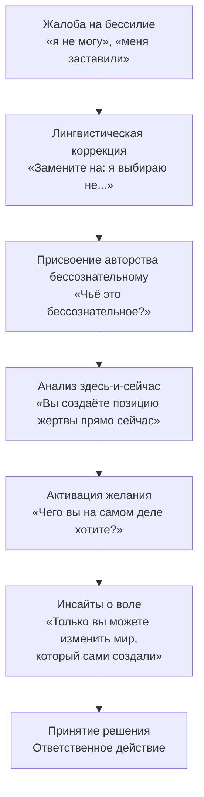

Клиент регулярно произносит одни и те же фразы: «я не могу», «меня заставили», «так сложилось». За этими словами прячется не правда — прячется защита от тревоги. Принять, что ты сам создал свою ситуацию, означает встретиться с безосновностью свободы: под человеком нет внешней структуры, которая решала бы за него *(Ялом, 2020)*.

**Позиция ответственности** — экзистенциальная техника, которая разрывает этот невротический цикл. Её центральный принцип: **ответственность означает абсолютное авторство** *(Ялом, 2020)*. Человек сам создаёт свой жизненный замысел. Осознание собственного авторства — не обвинение и не наказание, а необходимая предпосылка любого терапевтического изменения.

Концепция *Homo Patiens* (Франкл) подчёркивает: человек сохраняет свободу выбирать свою установку даже в неизменных обстоятельствах *(Франкл, 2020)*. Переход от позиции «я вынужден» к позиции «я выбираю» активирует дремлющую волю — ответственную движущую силу, которая переводит понимание в конкретное действие *(Мэй, 2020)*.

### Показания: когда нужна конфронтация с авторством

Метод применяется при работе с **избеганием ответственности**. Клиент постоянно жалуется на внешние обстоятельства *(Ялом, 2020)*. Он использует формулировки бессилия — «я не могу», «мне пришлось», «так вышло». Компульсивное поведение переносит ответственность на терапевта или отрицает собственный контроль над ситуацией. Тупик в терапии возникает из-за ожидания «чудесного спасения» извне *(Ялом, 2020)*.

**Абсолютные противопоказания:**
- **Реальные жертвы насилия.** Жёсткая конфронтация людям в ситуации актуального физического насилия — психологическое насилие.
- **Тяжёлая клиническая депрессия.** Пациенты уже раздавлены патологическим чувством вины. Призыв «взять ответственность» усилит самобичевание и суицидальный риск *(Ялом, 2020)*.
- **Острые психотические состояния.** Способность к экзистенциальному выбору требует сохранного тестирования реальности.

### Механизм: языковой и волевой сдвиг

Ответственность — абсолютное авторство *(Ялом, 2020)*. Избегание ответственности связано со страхом перед пустотой свободы. Пациент использует психологические защиты, чтобы не встречаться с этой пустотой.

Невротический цикл разрывается через **два одновременных сдвига**. Первый — **лингвистический**: терапевт переводит «я не могу» в «я выбираю не», обнажая скрытое авторство. Второй — **волевой**: терапевт помогает клиенту прорваться сквозь апатию, найти желание, а затем мобилизовать волю *(Мэй, 2020)*.

### Протокол: пять шагов активации авторства

**Шаг 1. Остановка лингвистических защит.** Терапевт выявляет формулировки бессилия и просит клиента немедленно изменить их. Скрипт: «Замените фразу "я не могу" на "я не буду" или "я предпочитаю не делать этого"» *(Ялом, 2020)*.

**Шаг 2. Возвращение авторства бессознательному.** Клиент ссылается на неподконтрольные внутренние силы. Терапевт жёстко возвращает ему ответственность. Скрипт: «Вы говорите, что сделали это бессознательно. Но чьё это бессознательное?» *(Ялом, 2020)*

**Шаг 3. Фокусировка на «здесь-и-сейчас».** Терапевт переводит обсуждение из прошлого в текущий момент и показывает избегание решений прямо в кабинете. Скрипт: «Посмотрите, как вы прямо сейчас создаёте свою позицию жертвы, ожидая, что я приму решение за вас» *(Ялом, 2020)*.

**Шаг 4. Активация желания.** Желание даёт воле теплоту и содержание *(Мэй, 2020)*. Скрипт: «Чего вы на самом деле хотите прямо сейчас, если отбросить все "я должен"?» *(Ялом, 2020)*

**Шаг 5. Активизация воли через инсайты.** Терапевт использует четыре ключевых утверждения для запуска волевого акта *(Молчанов, 2026)*. Скрипт: «Только вы можете изменить мир, который сами создали. Чтобы получить то, чего вы действительно хотите, вы должны измениться» *(Ялом, 2020)*.

### Кейсы: три примера из практики

**Кейс 1. Бернард и защита компульсивностью.** Двадцатипятилетний коммивояжёр страдал от навязчивого поведения: сексуальные связи и работа захлёстывали его жизнь *(Ялом, 2020)*. Бернард воспринимал себя жертвой чуждой, неуправляемой силы. В ходе терапии он оговорился: намеренно позвонил слишком поздно и сорвал встречу, а затем с облегчением заявил: «Теперь я смогу выспаться — чего я на самом деле и хотел». Терапевт немедленно конфронтировал: «Если вы этого на самом деле хотели — почему не сделали это прямо?» *(Ялом, 2020)*. Бернард осознал: компульсивность позволяла ему избегать бремени свободного выбора. Обнаружение скрытого желания разрушило иллюзию «неуправляемой силы» и вернуло способность к осознанному волевому акту.

**Кейс 2. Жена, которая мечтает о чужом решении.** Пациентка жила в деструктивных отношениях с мужем и заявляла, что «не в состоянии» принять решение о разрыве *(Ялом, 2020)*. Она мечтала застать мужа в постели с другой — чтобы решение было принято за неё. Терапевт выявил скрытые действия пациентки: постоянные отказы в близости, намёки, подталкивающие мужа к измене. Пациентка обнаружила своё активное участие в разрушении брака. Фундаментальное решение о разрыве несёт боль экзистенциальной изоляции *(Ялом, 2020)*. Перенос ответственности на мужа позволял ей сохранять статус невинной жертвы. Признание авторства вернуло ей возможность выбора.

**Кейс 3. Джордж и делегирование решения терапевту.** Тридцатилетний стоматолог категорически отказывался брать ответственность за разрыв отношений *(Ялом, 2020)*. Он оставлял улики — окурки и шпильки других женщин в машине — на видном месте, чтобы подруга сама ушла. Терапевт отказывался давать советы и выдерживал долгие паузы. В ходе сессии Джордж совершил инсайтный прорыв: «Если кто-нибудь другой примет решение, я уже не буду обязан делать эту работу» *(Ялом, 2020)*. Каждое решение требует отказа от альтернатив — и этот отказ порождает боль *(Ялом, 2020)*. Признание скрытой выгоды от пассивности активировало волю.

### Руководство для самостоятельной работы: лингвистический детокс

**Шаг 1. Инвентаризация.** Выпишите три вещи, которые вас тяготят, используя привычную формулировку «я не могу». Пример: «Я не могу уволиться с этой ужасной работы».

**Шаг 2. Возвращение авторства.** Зачеркните «я не могу». Напишите сверху: «Я выбираю не...». Прочитайте вслух. Бессилие уходит — появляется тяжесть взрослого выбора.

**Шаг 3. Поиск скрытой выгоды.** Задайте честный вопрос: «Ради чего я делаю этот выбор? Какую потребность я защищаю?» Допишите: «Я выбираю не увольняться, потому что боюсь финансовой неопределённости больше, чем ненавижу начальника».

Теперь это осознанный выбор. С этого момента можно честно решать: готовы ли вы платить такую цену за свой страх.

### Ошибки терапевта и сопротивление

**Сопротивление клиента.** Типичная реакция: «Вы сидите в комфортном кабинете и рассуждаете о свободе! Мой начальник — объективный садист. Это объективная реальность!» *(Ялом, 2020)*. Ответ: «Вы абсолютно правы. Ваш начальник действительно жесток — это ваш "коэффициент неблагоприятности". Но давайте посмотрим на вашу часть ответственности: почему вы выбираете оставаться в этих условиях?». Терапевт переводит фокус с внешнего факта на внутреннее решение пациента терпеть этот факт.

**Ошибка: игнорирование реальных жертв.** Не применять конфронтационные техники к людям в ситуации актуального физического насилия. Вменение им полной ответственности за положение — психологическое насилие, а не терапия.

### Маркеры прогресса

| Признак | Проявление |
| :--- | :--- |
| **Лингвистический сдвиг** | Исчезают безличные конструкции. Появляются: «я не буду», «я предпочитаю», «я выбираю» |
| **Исчезновение козлов отпущения** | Клиент перестаёт винить родителей, правительство, супругов или своё «бессознательное» |
| **Инициация действия** | Клиент переходит от бесконечных размышлений к конкретным поступкам. Воля мобилизована *(Мэй, 2020)* |

### Заключение и Литература

Позиция ответственности — экзистенциальная техника Ялома, которая разрывает невротический цикл жертвы через пять последовательных шагов: от лингвистической замены до активации желания и воли. Ответственность здесь — не наказание и не повод для вины, а единственная точка, из которой возможно реальное изменение. Когда клиент признаёт себя автором своей ситуации, он возвращает себе и право её изменить.

- Молчанов, С. В. (2026). *Введение в экзистенциальный анализ. Курс лекций*.
- Мэй, Р. (2020). *Любовь и воля*.
- Мэй, Р. (2020). *Экзистенциальная психология*.
- Франкл, В. (2020). *Психотерапия на практике*.
- Ялом, И. (2020). *Экзистенциальная психотерапия*. Класс.

---

**Проверка понимания.** Клиент на третьей сессии говорит: «Мне приходится ходить на эту нелюбимую работу — у меня просто нет выбора. Ипотека, дети, всё это навалилось само». При этом он уже полгода откладывает разговор с работодателем о повышении, хотя имеет для этого все основания. Применяя Шаги 1–3 протокола, покажите: (а) как именно вы проведёте лингвистическую коррекцию его фразы «мне приходится»; (б) какую «скрытую выгоду» вы предположите и как зададите вопрос на Шаге 4 об этой выгоде, не превращая терапию в обвинение?
