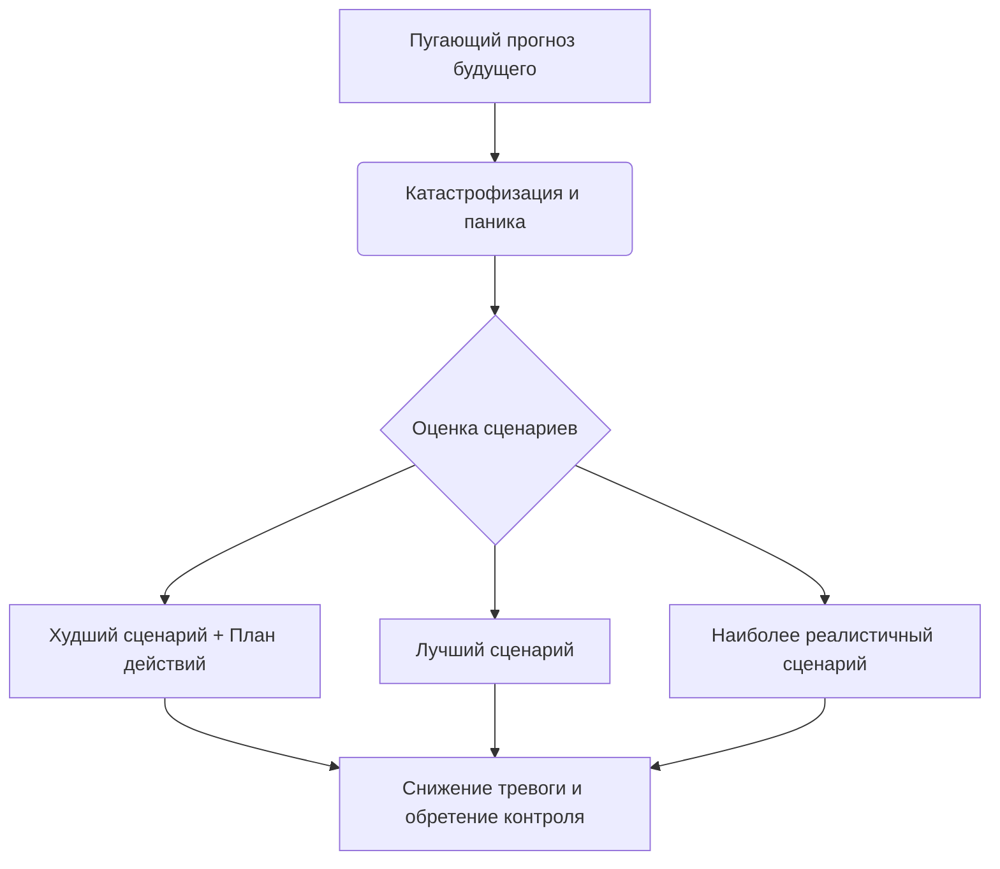

Когда мы сталкиваемся с пугающей неопределенностью, наш разум часто превращается в режиссера фильмов-катастроф. Мы теряем сон перед важным событием, будучи абсолютно уверенными в неминуемом провале. Тревога сковывает нас, заставляя верить, что грядущая беда не просто возможна, а неизбежна, и мы совершенно точно не сможем с ней справиться.

Этот механизм держит нас в колоссальном напряжении, заставляя тратить энергию на переживания о том, что еще даже не произошло. Техника прогнозирования сценариев помогает разорвать этот замкнутый круг. Она не заставляет слепо верить в чудо, а возвращает способность мыслить рационально, превращая пугающую неизвестность в набор конкретных и управляемых ситуаций.

## Определение и польза: Шаг от паники к объективности

**Прогнозирование сценариев** (или декатастрофизация) — это метод когнитивно-поведенческой терапии, направленный на проверку пугающих прогнозов будущего и объективную оценку вашей способности справиться с трудностями *(Bank et al., 2020)*.

Ее главная практическая польза заключается в нейтрализации **катастрофизации** (склонности автоматически воспринимать любую неприятность как невыносимую трагедию с недооценкой своих сил) и **предсказания будущего** (иррациональной уверенности в негативном исходе без реальных доказательств) *(Bank et al., 2020)*. Вместо того чтобы паниковать или избегать мыслей о проблеме, вы используете структурированный подход. Это смещает фокус с парализующего ожидания «ужасного финала» на конструктивное планирование *(Cully et al., 2020)*.

## Архитектура метода: Три точки опоры

Правильная оценка будущего всегда опирается на «Правило трех», которое заставляет нас исследовать весь спектр возможностей:

1. **Оценка худшего сценария:** Тот самый пугающий исход, который крутится в голове. Мы позволяем себе заглянуть в этот страх, чтобы понять его границы и разработать план спасения.
2. **Оценка лучшего сценария:** Максимально благоприятное, позитивное развитие событий.
3. **Определение наиболее реалистичного исхода:** Поиск «золотой середины» на основе фактов и прошлого опыта *(Cully et al., 2020)*.

**Механика работы:** Когда включается тревога, мозг использует негативный фильтр, сужая зрение до одной катастрофической точки. Выделение лучшего и реалистичного исходов искусственно активирует префронтальную кору головного мозга, отвечающую за логику. Создавая полярные варианты (от абсолютного кошмара до триумфа), мы формируем шкалу, на которой мозг естественным образом находит сбалансированную середину. Переводя страх из абстрактного «все будет ужасно» в конкретную плоскость, вы снижаете эмоциональный накал *(Bank et al., 2020)*.

## Ментальные модели и границы: Включение света в темной комнате

**Аналогия (Включение света):** Представьте, что вы проснулись ночью и видите в углу спальни страшный силуэт монстра. Ваша тревога кричит: «Это угроза!». Вы можете спрятаться под одеяло и дрожать до утра (избегание). Но прогнозирование сценариев работает иначе — вы просто включаете свет. Вы не пытаетесь убедить себя, что монстров не существует в принципе, вы лишь оцениваете конкретный силуэт и видите, что это стул с одеждой. Вы опираетесь на факты.

**Чем это не является:** Эту технику часто путают с позитивным мышлением. Мы не пытаемся надеть розовые очки и убедить себя, что всегда будет происходить только лучшее. Суть метода — реалистичность, а не слепой оптимизм.

| Позитивное мышление (Слепой оптимизм) | Прогнозирование сценариев (Декатастрофизация) |
| :--- | :--- |
| «Ничего плохого на собеседовании не произойдет, волноваться не о чем!» | «Даже если мне откажут, я переживу это и получу опыт для следующего интервью.» |
| «Я точно сдам этот сложный экзамен на отлично!» | «Я могу получить низкую оценку, но я знаю, как ее пересдать или исправить.» |

## Практическое применение: Переход от страха к плану

Рассмотрим, как это выглядит в реальной жизни:

*   **Ситуация — Действие — Результат (Тревога перед выступлением):** Клиент паникует перед презентацией, думая: «Я заикнусь, провалюсь, и меня уволят».
    *   *Действие:* Он задает себе вопрос: «Если моя мысль верна, что самое худшее может случиться? И как бы я с этим справился?» *(Cully et al., 2020)*.
    *   *Результат:* Он осознает, что даже при неудачном выступлении увольнение маловероятно, а заминку можно сгладить извинениями. Тревога падает.
*   **Ситуация — Действие — Результат (Ипохондрия):** Девушка чувствует учащенное сердцебиение и думает: «У меня сердечный приступ».
    *   *Действие:* Она оценивает худший исход (приступ, при котором она вызовет скорую), лучший исход (это просто усталость) и реалистичный (это проявление ее привычной тревоги).
    *   *Результат:* Выбор реалистичного сценария останавливает развитие панической атаки.

**Пошаговый алгоритм внедрения:**
1. **Зафиксируйте страх:** Четко опишите свой пугающий прогноз.
2. **Исследуйте худший сценарий:** Спросите себя: «Что самое страшное может произойти?». Затем задайте главный вопрос: «Как я с этим справлюсь? Были ли в прошлом ситуации, когда я справлялся с подобным?» *(Bank et al., 2020)*.
3. **Сформулируйте лучший сценарий:** Спросите: «Если моя автоматическая мысль верна, что самое лучшее может случиться?» *(Cully et al., 2020)*.
4. **Найдите реалистичный исход:** Опираясь на факты, ответьте: «Какой исход событий наиболее реалистичен?» *(Cully et al., 2020)*.
5. **Оцените свое состояние:** Проверьте, снизилась ли интенсивность страха после составления плана.

*Частая ловушка:* Застревание на поиске худшего сценария без перехода к вопросу «Как я с этим справлюсь?». Без поиска решений анализ только усилит тревогу. Также ошибкой является отказ придумывать лучший сценарий — контраст между ужасным и прекрасным необходим мозгу, чтобы нащупать реальность.

## Свобода выбора: Усилия на пути к реализму

Наш мозг эволюционно запрограммирован искать опасности, поэтому привычка рисовать в уме катастрофы кажется ему самым надежным способом перестраховаться. Отказаться от этого автоматического механизма в моменты сильного стресса — задача, требующая значительных внутренних ресурсов и дисциплины. Потребуется немалое мужество, чтобы честно и прямо посмотреть в глаза своим самым глубоким опасениям при описании худшего исхода, вместо того чтобы избегать их или слепо надеяться на чудо.

Однако эти методичные тренировки окупаются многократно. Осознав, что катастрофа — это лишь один из вариантов (и зачастую самый маловероятный), и что вы способны разработать план действий даже для неблагоприятного исхода, вы освобождаете огромное количество энергии. Жизнь перестает казаться непредсказуемым минным полем. Со временем эти упражнения перестроят ваши нейронные связи, сделав реалистичный анализ автоматической реакцией на любой стресс, и вы обретете спокойствие, необходимое для уверенного движения вперед.

## Главный вывод и литература

> Прогнозирование сценариев не гарантирует, что в жизни не будет трудностей или неудач. Но этот навык убедительно доказывает: вы гораздо сильнее, находчивее и выносливее, чем пытается внушить вам ваш страх.

**Источники:**
* *Bank, S., Burgess, M., Sng, A., Summers, M., Campbell, B., & McEvoy, P. (2020). Stepping Out of Social Anxiety. Centre for Clinical Interventions.*
* *Cully, J. A., Dawson, D. B., Hamer, J., & Tharp, A. L. (2020). A Provider’s Guide to Brief Cognitive Behavioral Therapy. Department of Veterans Affairs South Central MIRECC.*
* *Бек, Дж. С. (2020). Когнитивная терапия для сложных случаев: что делать, когда простые решения не работают. ООО "Диалектика".*
* *Лихи, Р. (2018). Лекарство от нервов. Как перестать волноваться и получить удовольствие от жизни.*
* *Лихи, Р. (2020). Техники когнитивной психотерапии. Питер.*

---

### Проверка понимания (Микро-кейс)

**Ситуация:** Сергей очень боится летать на самолетах. Перед командировкой он не может уснуть из-за мысли: «Самолет обязательно попадет в турбулентность, мы разобьемся, и я погибну». Чтобы успокоить себя, он начинает повторять: «Нет, погода завтра будет идеальной, пилот — профессионал с огромным стажем, полет пройдет абсолютно гладко, мне совершенно нечего бояться».

**Вопрос:** Какую ошибку совершил Сергей, пытаясь справиться со своей тревогой? Как бы выглядел его внутренний монолог, если бы он правильно применил метод «Прогнозирование сценариев» по всем трем шагам алгоритма?
