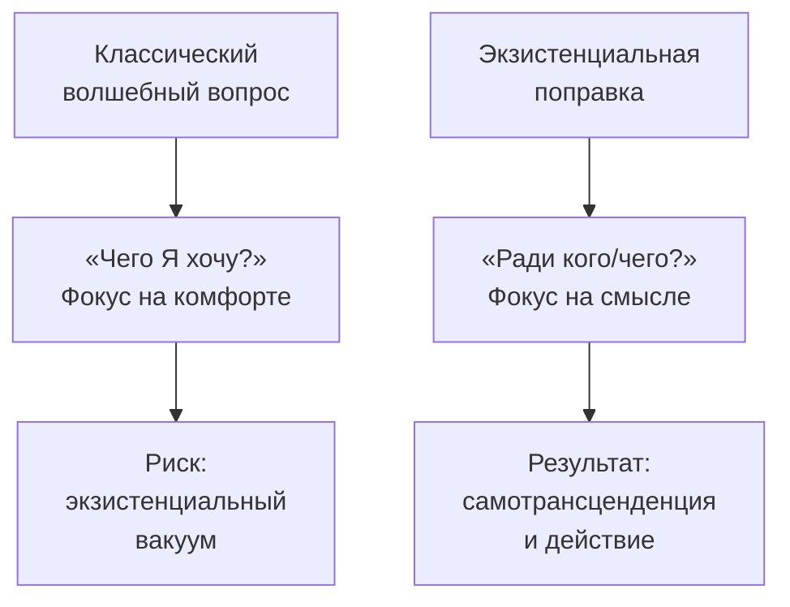

«Если бы чудо случилось и вы проснулись свободным, что бы вы делали?» — классический «волшебный вопрос» в психотерапии. Он помогает клиенту представить желаемое будущее. Но с точки зрения экзистенциального анализа такая формулировка неполна: она фокусирует человека на собственном комфорте, а не на смысле. Добавление одной короткой фразы — **«ради кого или ради чего вы бы стали это делать?»** — радикально меняет вектор терапии.

Эта экзистенциальная поправка переводит клиента из пассивного ожидания чуда в активную позицию творца, который отвечает на вопросы жизни конкретными действиями.

### Парадокс счастья: почему стремление к нему обречено

Франкл указывал на парадоксальность принципа удовольствия: чем сильнее человек стремится к счастью, превращая его в мишень, тем вернее он его упускает. **Счастье и удовлетворение** возникают спонтанно, как побочный эффект преданности большому делу или любви к другому человеку. «Дверь к счастью открывается наружу», и тот, кто пытается тянуть её на себя, лишь плотнее закрывает.

Если клиент в ответ на «волшебный вопрос» конструирует только состояние радости и свободы, он рискует оказаться в **экзистенциальном вакууме**. Для душевного здоровья необходимо не отсутствие напряжения, а **ноодинамика** — экзистенциальное напряжение между человеком и смыслом, который ожидает осуществления.

### Коперниканский переворот: жизнь спрашивает, человек отвечает

Поправка «ради чего/кого?» реализует на практике **«коперниканский переворот» Франкла**. Человек должен перестать спрашивать, чего он ожидает от жизни. Вместо этого ему нужно осознать: это *жизнь* ежедневно задаёт вопросы. Ответить на них можно не размышлениями о счастье, а конкретными действиями и принятием ответственности.

| Позиция | Вопрос | Результат |
|---|---|---|
| Потребитель жизни | «Что жизнь должна мне дать?» | Пассивность, разочарование |
| Автор жизни | «Какой ответ я готов дать жизни?» | Ответственность, смысл |

Экзистенциальный вопрос выводит клиента из позиции ожидания чуда в позицию творца: «Какой ответ я готов дать миру своими действиями?»

### Самотрансценденция: выйти за пределы себя

Вопрос «ради кого/чего?» апеллирует к базовой характеристике человеческого бытия — способности к **самотрансценденции**. Быть человеком означает выходить за пределы самого себя, направлять существование на нечто или кого-то другого.

Истинный смысл всегда находится во внешнем мире, а не внутри замкнутой системы «Я». Борьба за идентичность и счастье обречена на неудачу, если она не сопровождается самоотверженным посвящением себя чему-то большему. Ялом подчёркивал: поиск светского смысла чаще всего увенчивается успехом через альтруизм, служение другим и творчество ради того, чтобы сделать мир лучше.

### Магическая сила слова «ради»

Лукас подчёркивала: слово **«ради»** обладает волшебной силой в психотерапии. Если намерения человека искренни, понимание того, *ради чего* он действует, помогает обуздать агрессивные импульсы, справиться с ненавистью, преодолеть апатию. Когда человек осознаёт свою незаменимость для другого (кого он любит) или для незавершённого дела, он обретает силу вынести тяжелейшие испытания.

Этот принцип резюмируется словами Ницше, которые часто цитировал Франкл: **«У кого есть "зачем" жить, вынесет почти любое "как"»**.

### Проверка решения: ценность, свобода, ответственность

В методологии персонального экзистенциального анализа (ПЭА) Лэнгле вопрос «ради чего?» играет роль финального фильтра. Любой осмысленный выбор должен удовлетворять трём условиям:

| Условие | Вопрос | Что проверяет |
|---|---|---|
| Ценность | «Важно ли это для меня?» | Есть ли подлинное значение |
| Свобода | «Делаю ли я это добровольно?» | Нет ли внешнего принуждения |
| Ответственность | «Ради кого/чего я это делаю?» | Готов ли я вложить труд |

Свобода, заявленная в первой части «волшебного вопроса», может выродиться в произвол, если не ограничена ответственностью. Вопрос «ради кого/чего?» проверяет действие на ответственность.

### Как использовать поправку на практике

**Для терапевта.** Когда клиент отвечает на волшебный вопрос описанием желаемого состояния, задайте уточняющий вопрос:
- «А ради кого вы бы стали это делать?»
- «Кому, кроме вас, станет лучше от этого?»
- «Какому делу или человеку будет служить эта ваша новая свобода?»

**Для клиента.** Когда вы мечтаете о переменах, проверьте своё желание тройным фильтром:

1. **Ценность.** Это действительно важно для меня или я бегу от дискомфорта?
2. **Свобода.** Я выбираю это сам или подчиняюсь давлению?
3. **Ответственность.** Ради кого или ради чего я это делаю? Готов ли я вложить усилия?

Если на третий вопрос нет ответа — желание, скорее всего, направлено внутрь, на собственный комфорт. Такое «чудо» быстро обернётся новой пустотой.

> Экзистенциальная поправка трансформирует абстрактную фантазию о благополучии в конкретный план осмысленного бытия. Даже гипотетическое чудо обретения свободы не освобождает от необходимости вступать в диалог с миром.

### Пример применения

**Классический вопрос:** «Если бы чудо случилось и вы проснулись здоровым, что бы вы делали?»

**Ответ клиента:** «Путешествовал бы, наслаждался жизнью, ни о чём не думал».

**Экзистенциальная поправка:** «А ради кого или ради чего вы бы путешествовали? Кому вы привезли бы эти впечатления? Что нового о мире вы хотели бы понять и передать другим?»

Клиент задумывается. Фокус смещается с потребления впечатлений на отдачу: «Я бы хотел показать своим детям мир, который я не видел в их возрасте». Теперь у желания есть адресат. Оно перестало быть эгоцентричной фантазией и стало осмысленным намерением.

### Заключение и Литература

Классический «волшебный вопрос» помогает клиенту представить желаемое будущее, но фокусирует его на внутреннем комфорте. Экзистенциальная поправка — «ради кого или ради чего?» — реализует коперниканский переворот Франкла: переводит фокус с ожидания от жизни на ответственный ответ жизни. Вопрос апеллирует к самотрансценденции — способности выйти за пределы себя и направить существование на смысл во внешнем мире. Слово «ради» проверяет решение на ответственность и превращает абстрактную мечту в конкретный план осмысленного действия.

- Франкл, В. (1990). *Человек в поисках смысла*. М.: Прогресс.
- Лукас, Э. (2020). *Учебник логотерапии*. М.: Новый Акрополь.
- Ялом, И. (2020). *Экзистенциальная психотерапия*. М.: Класс.
- Лэнгле, А. (2019). *Персональный экзистенциальный анализ*. М.: Генезис.

---

**Контрольный вопрос:** Клиент отвечает на волшебный вопрос: «Если бы я проснулся без тревоги, я бы наконец отдохнул и ничего не делал». Как вы примените экзистенциальную поправку и какой вопрос зададите, чтобы помочь ему обнаружить смысл за желанием покоя?
