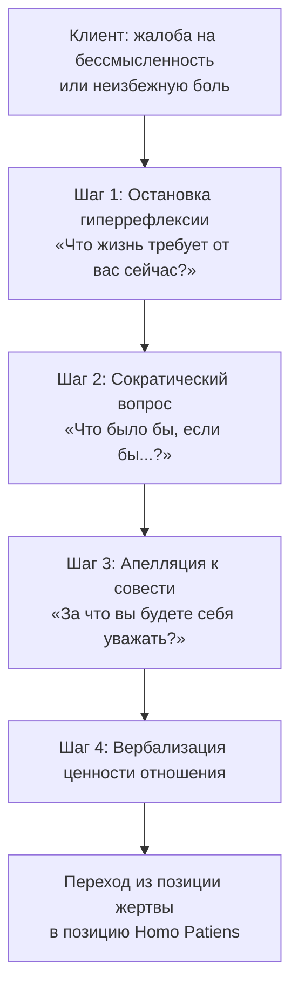

Клиент переживает острый кризис и задаёт вопрос «За что мне это?» — снова и снова, по кругу. Когнитивно-поведенческий терапевт в этот момент ищет логические ошибки. Логотерапевт ищет кое-что иное: **скрытый смысл** в том, что кажется бессмысленным.

**Сократический диалог в логотерапии** — метод, принципиально отличный от техники сократического вопросования в КПТ *(Лукас, 2019)*. Когнитивный терапевт оспаривает иррациональные убеждения. Логотерапевт обращается к духовному измерению человека (ноэзису) — к интуитивному «предзнанию» смысла, заложенному в каждом *(Лукас, 2019)*. Терапевт выступает в роли «повивальной бабки» (маевтика): он не рисует готовую картину мира — он очищает зрение пациента, чтобы тот сам увидел спектр потенциальных смыслов *(Frankl, 2005)*.

### Показания: ноогенный невроз и трагическая триада

Метод показан при **ноогенных неврозах** и экзистенциальном вакууме *(Frankl, 2005)*. Экзистенциальный вакуум проявляется через апатию, хроническую скуку и утрату жизненных целей. Клиент чувствует себя беспомощной жертвой обстоятельств.

Техника применяется при столкновении человека с **неизбежным страданием** — трагической триадой: боль, вина, смерть. Психоаналитические интерпретации прошлого в таких ситуациях бесполезны: клиенту требуется экзистенциальная перестройка *(Лукас, 2019)*.

> Фундаментальное антропологическое допущение: человек способен трансформировать неизбежную боль в нравственное достижение (*Лукас, 2019*). Логотерапевт обращается к упрямству духа — к дремлющей «воле к смыслу».

**Противопоказания:**
- **Тяжёлая эндогенная депрессия (острая фаза):** биологически заблокирована способность к восприятию смысла. Разговоры о жизненных задачах лишь усилят патологическое чувство вины *(Лукас, 2019)*.
- **Острый психоз с бредом:** апелляция к «воле к смыслу» неуместна — нарушено различение смысла и бессмыслицы.

### Механизм: феноменологический переворот

Активный ингредиент техники — **феноменологический сдвиг фокуса внимания**. Человек перестаёт спрашивать жизнь о её смысле. Он понимает, что жизнь сама задаёт ему вопросы *(Frankl, 2005)*.

Диалог выстраивается вокруг **трёх путей к смыслу**: ценностей творчества (что человек отдаёт миру), ценностей переживания (что он принимает от мира) и ценностей отношения (позиция, которую занимает по отношению к неизбежному страданию). Терапевт не навязывает смысл. Он задаёт вопросы, апеллирующие к духовному ядру клиента (Person), — и ждёт, пока ответ созреет.

### Протокол: четыре шага маевтики

Логотерапевтический диалог требует от терапевта позиции трагического оптимиста: вопросы должны быть слегка фрустрирующими — они бросают вызов, а не успокаивают.

**Шаг 1. Остановка эгоцентрической гиперрефлексии.** Терапевт прерывает бесконечный поток жалоб. Фокус переводится с проблемы на личность клиента. Скрипт: «Я слышу вашу боль. Мы не можем отменить эти тяжёлые факты. Но прямо сейчас вы полностью поглощены вопросом "За что мне это?". Давайте изменим вопрос: что эта ситуация требует от вас прямо сейчас?»

**Шаг 2. Игра с альтернативами.** Терапевт задаёт гипотетические вопросы, расширяя суженное поле зрения. Скрипт: «Давайте на минуту представим другую реальность. Что было бы, если бы на вашем месте оказался человек, которого вы любите больше всего? Какую цену вы платите сейчас, чтобы избавить его от этой участи?»

**Шаг 3. Апелляция к совести.** Терапевт обращается к интуитивному предзнанию смысла. Скрипт: «Забудьте на мгновение о том, чего хотите вы. Послушайте свой внутренний голос. Какой ответ на этот вызов судьбы вы сами назвали бы самым достойным? Если вы посмотрите на себя из будущего — за какой поступок в этой ситуации будете себя уважать?»

**Шаг 4. Утверждение ценности отношения.** Терапевт помогает клиенту вербализовать найденный смысл. Ответственность возвращается пациенту. Скрипт: «То, как вы несёте это страдание, является вашим личным достижением. Никто не может отнять у вас вашу внутреннюю позицию. Готовы ли вы принять эту задачу как вашу собственную ответственность?»

### Кейсы: три примера из практики

**Кейс 1. Скорбящий врач.** Пожилой врач переживал тяжёлую депрессию в течение двух лет после смерти любимой жены *(Ялом, 2008)*. Франкл задал один сократический вопрос: «Что произошло бы, доктор, если бы вы умерли первым, а вашей жене пришлось пережить вас?» Врач ответил, что для жены это было бы ужасно. Франкл подытожил: «Она избежала этих страданий — и именно вы избавили её от них. Но вы должны платить за это тем, что пережили и оплакиваете её» *(Ялом, 2008)*. Врач молча пожал руку терапевта и спокойно покинул кабинет. Терапевт не пытался обесценить боль — он помог найти смысл в самом страдании. Боль превратилась в осмысленную жертву ради любимого человека.

**Кейс 2. Дипломат на перепутье.** Американский дипломат пять лет лечился у психоаналитика от желания сменить профессию. Психоаналитик интерпретировал это как «непримиримую борьбу против образа отца» *(Лукас, 2021)*. Франкл применил сократический диалог, исследуя подлинную волю клиента через вопросы о ценностях творчества. Выяснилось: желание сменить профессию продиктовано духовным поиском, а не бессознательными комплексами. Франкл поддержал намерение дипломата. Тот поменял профессию и обрёл внутреннюю стабильность *(Лукас, 2021)*. Техника помогла избежать патологизации: терапевт апеллировал к духовной свободе личности, а не к влечениям.

**Кейс 3. Неизлечимо больная фрау Линек.** Восьмидесятилетняя пациентка умирала от неоперабельного рака *(Frankl, 2005)*. Франкл инициировал сократический диалог: «Как вы думаете, вместе с вами из мира исчезнет и всё хорошее, что вы пережили? Способен ли кто-то отменить счастье, которое вы пережили?» — «Нет, никто», — ответила пациентка. Продолжение: «А может кто-нибудь устранить из мира то, что вы терпеливо и мужественно выстрадали?» Пациентка заплакала. Депрессия отступила. Она умерла в мире, осознав своё достойное поведение в болезни как великое достижение *(Ялом, 2008)*. Диалог перевёл фокус с физического угасания на духовное бессмертие совершённых поступков.

### Руководство для самостоятельной работы: сократическое зеркало

Когда случается кризис, разум попадает в ловушку тупиковых вопросов: «За что мне это?», «Почему именно я?». Эти вопросы лишают сил. Ниже — трёхшаговая практика (10 минут), которая возвращает управление.

**Шаг 1. Переворот вопроса.** Перестаньте спрашивать, чего вы ждали от жизни. Напишите ответ: *«Чего жизнь требует от меня прямо сейчас, в этих тяжёлых условиях?»*

**Шаг 2. Взгляд из будущего.** Представьте, что прошло 10 лет. Напишите: *«С каким чувством я хочу вспоминать этот момент? Если я выдержу это испытание с достоинством — как это изменит меня?»* *(Лукас, 2021)*

**Шаг 3. Ради кого?** Напишите: *«Если я не могу изменить эту боль ради себя — ради кого из близких я должен нести её достойно? Кому прямо сейчас нужен пример моей стойкости?»*

Смысл не нужно выдумывать. Он уже есть в ситуации. Ваша задача — увидеть его и ответить на вызов.

### Ошибки терапевта и сопротивление

**Сопротивление клиента.** Типичная реакция: «Эти философские разговоры не изменят факта моей болезни или потери. Вы просто пытаетесь меня утешить красивыми словами». Ответ: «Вы правы — факты изменить нельзя. Сократический диалог нужен не для того, чтобы изменить факты. Он нужен, чтобы изменить того, кто с ними столкнулся. Никто не может отнять у вас свободу выбрать своё отношение к факту».

**Ошибка 1: Морализаторство.** Логотерапевт не проповедует. Если терапевт говорит клиенту, в чём состоит его смысл («Вы должны страдать ради детей»), он совершает насилие над духовной свободой человека *(Frankl, 2005)*. Смысл не выписывается в виде рецепта.

**Ошибка 2: Чрезмерное сочувствие.** Если терапевт соглашается с позицией клиента-жертвы, он подыгрывает эскапизму *(Frankl, 2005)*. Сократический диалог должен быть слегка фрустрирующим.

### Маркеры прогресса

| Признак | Проявление |
| :--- | :--- |
| **Снятие гипотезы притязаний** | Исчезают фразы «Жизнь мне должна», «Это несправедливо». Появляются: «Я отвечаю за...», «Моя задача состоит в...» |
| **Парадоксальная благодарность** | Клиент видит в кризисе источник духовного роста. Возникает гордость за мужественно перенесённое испытание |
| **Переход от гиперрефлексии к действию** | Человек перестаёт копаться в душевных ранах. Энергия направляется во внешний мир: на творчество, помощь другим, реализацию ценностей |

### Заключение и Литература

Сократический диалог в логотерапии — это маевтика смысла: терапевт не рисует картину, а помогает пациенту самому увидеть спектр возможных смыслов через четыре последовательных вопроса. Метод переводит фокус с тупиковых «почему» на действенные «ради чего» и «что ответить прямо сейчас». Три категории ценностей — творчество, переживание, отношение — образуют компас, по которому клиент находит смысл даже в самых тяжёлых условиях трагической триады.

- Frankl, V. E. (2005). *Сказать жизни «Да!»: психолог в концлагере*. Альпина нон-фикшн.
- Frankl, V. E. (1990). *Человек в поисках смысла*. Прогресс.
- Лукас, Э. (2019). *Источники осознанной жизни. Преврати проблемы в ресурсы*. Никея.
- Лукас, Э. (2021). *Свой путь направь к звезде. Душевное равновесие в трудное время*. Никея.
- Мэй, Р. (2001). *Экзистенциальная психология*. Эксмо-Пресс.
- Ялом, И. (2008). *Экзистенциальная психотерапия*. Класс.

---

**Проверка понимания.** Пациент 45 лет — врач, потерявший руку в аварии, страдает от тяжёлой депрессии. Он говорит: «Вся моя идентичность была в скальпеле. Моя жизнь потеряла смысл. Я жертва нелепой случайности». Вы хотите применить сократический диалог логотерапии. Какой вопрос вы зададите на Шаге 2 («Игра с альтернативами»), чтобы открыть доступ к ценностям отношения? Объясните, почему этот вопрос переводит клиента из позиции жертвы в позицию *Homo Patiens*, и какой ответ терапевта на шаге 4 завершит феноменологический сдвиг.
