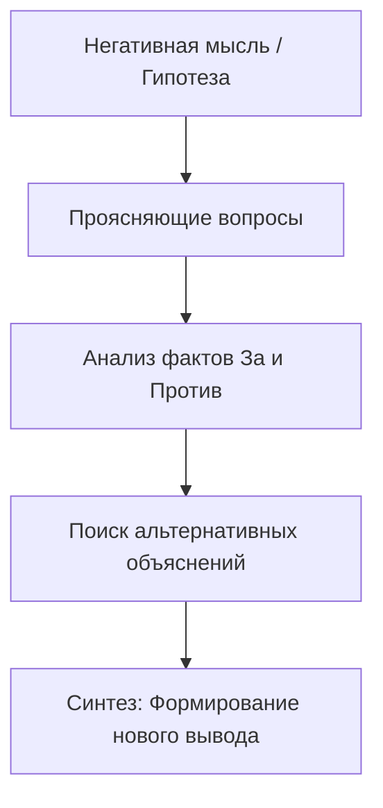

Часто, столкнувшись с жизненными трудностями, мы оказываемся в плену собственных негативных мыслей и перестаем видеть ситуацию объективно. В такие моменты прямые советы со стороны редко помогают — наша психика склонна сопротивляться чужим указаниям, защищая привычную, пусть и болезненную, картину мира.

Именно здесь на помощь приходит сократический диалог. Этот метод позволяет не навязывать человеку «правильный» образ мыслей, а мягко подвести его к тому, чтобы он сам подверг сомнению свои пугающие выводы и нашел выход из ментального тупика.

## Определение и утилитарность: Самостоятельный поиск истины

**Сократический диалог** — это форма совместной беседы, в которой с помощью серии тщательно выстроенных вопросов проясняется суть проблемы, выявляются скрытые убеждения и оценивается их достоверность *(Beck & Dozois, 2011)*. Этот процесс лежит в основе **направляемого открытия** — метода, при котором человек самостоятельно собирает факты и оценивает свой опыт, приходя к новым выводам *(Padesky, 1993)*.

Главная задача этого инструмента — расширить фокус внимания и помочь заметить ранее игнорируемые факты. Он развивает когнитивную гибкость — способность смотреть на ситуацию с разных сторон, вместо того чтобы просто выслушивать готовые лекции о том, как «нужно» думать *(James, 2020)*. Это превращает пассивного слушателя в активного исследователя собственной жизни.

## Большая картина и механика: Три этапа открытия

Архитектура сократического диалога базируется на последовательном продвижении от конкретных деталей к абстрактным выводам *(Padesky, 1993)*. Процесс включает три ключевых компонента:

1.  **Проясняющие вопросы (Сбор данных):** Беседа начинается с вопросов, на которые вы объективно знаете ответ. Цель — вывести из «слепой зоны» информацию, которая противоречит негативным ожиданиям *(Padesky, 1993)*.
2.  **Эмпатическое слушание и резюмирование:** Важно внимательно слушать и периодически подводить итоги сказанному. Это помогает структурировать мысли и снижает эмоциональное напряжение *(Padesky, 1993)*.
3.  **Синтезирующие вопросы (Новый вывод):** На финальном этапе задается вопрос, который связывает вновь обнаруженные факты с исходной проблемой. Это побуждает пересмотреть изначальное убеждение и сформировать реалистичную идею *(Padesky, 1993)*.

**Под капотом:** Любая мысль (например, «Я никому не нравлюсь») рассматривается не как истина, а как гипотеза, требующая проверки *(Padesky, 1993)*. Диалог активирует аналитическую часть мозга, заставляя самостоятельно взвешивать доказательства и находить логические противоречия в своих страхах.

## Ментальные модели и границы: Гид с фонариком

**Аналогия (Гид в темной комнате):** Представьте, что вы оказались в совершенно темной комнате, и луч вашего фонарика выхватывает только пугающие тени по углам. Человек, использующий сократический диалог, не включает внезапно верхний свет со словами: «Здесь нечего бояться!» (это вызвало бы лишь недоверие). Вместо этого он берет вас за руку, направляет ваш фонарик на другие объекты и спрашивает: «А что вы видите вот здесь? На что похож этот силуэт?». Вы сами исследуете комнату и убеждаетесь в своей безопасности.

**Контраст:** Важно понимать, чем этот метод не является, чтобы избежать типичных ошибок общения.

| Сократический диалог | Перекрестный допрос (ОШИБКА) |
| :--- | :--- |
| **Коллаборативный поиск:** Совместное исследование фактов без заранее известного ответа *(Padesky, 1993)*. | **Убеждение:** Попытка загнать человека в угол аргументами и заставить признать неправоту *(Padesky, 1993)*. |
| **Опора на опыт:** Вопросы задаются о том, что человек действительно знает и пережил *(Padesky, 1993)*. | **Чтение лекций:** Вопросы в стиле «А разве вы не понимаете, что...», содержащие скрытый упрек *(Beck, 2020)*. |
| **Любопытство:** Поиск альтернативных объяснений событию *(Beck, 2020)*. | **Инвалидация:** Утверждение, что мысль алогична и нужно просто перестать так думать *(Padesky, 1993)*. |

## Практическое руководство: Как перевести мысли в факты

Мысли и факты — это не одно и то же. Можно думать, что вы зебра, но эта мысль не превратит вас в животное — нужно всегда сверять идеи с реальностью *(Leahy, 2020)*.

**Клинические примеры:**
* **Ситуация (Социальная тревога):** Эйб думал, что друг Чарли не хочет с ним общаться, так как тот не звонил месяц.
    * **Действие:** Вместо спора задаются вопросы: «Каковы доказательства этого? Что Чарли говорил при последней встрече?». Выяснилось, что Чарли выражал поддержку.
    * **Результат:** Эйб сам пришел к выводу, что друг просто занят *(Beck, 2020)*.
* **Ситуация (Дихотомическое мышление):** Диана считала себя скучной, если не могла очаровать всех вокруг.
    * **Действие:** Ей предложили на вечеринке выступить в роли «интервьюера» и расспрашивать других.
    * **Результат:** Люди сочли ее прекрасным собеседником, и ее жесткое правило «либо очаровываю, либо скучна» было разрушено *(Leahy, 2018)*.

**Алгоритм реализации:**
1.  **Сформулируйте мысль:** Четко озвучьте пугающее убеждение *(Beck, 2020)*.
2.  **Запросите доказательства:** Спросите: «Какие есть факты за эту мысль? А какие против?» *(Beck, 2020)*.
3.  **Ищите альтернативы:** Спросите: «Существует ли другое объяснение этому событию?» *(Beck, 2020)*.
4.  **Декатастрофизируйте:** Оцените последствия: «Что самое худшее может случиться? Что самое хорошее? Что наиболее вероятно?» *(Beck, 2020)*.
5.  **Дистанцируйтесь:** Спросите: «Если бы в такой ситуации оказался ваш друг, что бы вы ему сказали?» *(Beck, 2020)*.

*Общая ловушка:* Пытаться использовать вопросы как инструмент давления, чтобы быстро «исправить» чужое мышление. Если человек не имеет ответа на вопрос (например, при алекситимии), это вызовет лишь замешательство и раздражение *(Padesky, 1993)*.

## Самостоятельность через осознанный поиск истины

Овладение искусством сократического диалога кардинально меняет подход к собственным проблемам. Когда вы самостоятельно обнаруживаете несостоятельность своих страхов, этот новый вывод встраивается в психику гораздо глубже, чем любой совет извне. Метод развивает навык критического мышления, который позволяет в будущем становиться «терапевтом для самого себя» *(Padesky, 1993)*.

Этот путь требует изрядного терпения и выдержки. Придется отказаться от привычки искать быстрые, готовые решения и научиться выдерживать паузы, позволяя себе блуждать в поиске ответов. Это непростой труд — искренне интересоваться фактами, а не следовать за эмоциями *(Padesky, 1993)*. Однако именно совместный путь через сомнения к ясности обеспечивает самые стойкие и трансформационные результаты, делая вас устойчивым к будущим жизненным вызовам.

## Заключение и литература

Сократический диалог — это не допрос, а партнерское путешествие за истиной. Аккуратно задавая вопросы, вы помогаете себе или другому человеку прорваться сквозь пелену искажений и найти опору в реальности.

**Источники:**
* *Beck, J. S. (2020). Когнитивная терапия для сложных случаев: что делать, когда простые решения не работают. ООО "Диалектика".*
* *Dobson, D., & Dobson, K. (2021). Научно-обоснованная практика в когнитивно-поведенческой терапии. Питер.*
* *James, I. A. (2020). Преднамеренная практика в когнитивно-поведенческой терапии.*
* *Leahy, R. (2018). Лекарство от нервов. Как перестать волноваться и получить удовольствие от жизни.*
* *Leahy, R. (2020). Техники когнитивной психотерапии. Питер.*
* *Padesky, C. A. (1993). Socratic Questioning: Changing Minds or Guiding Discovery? Центр когнитивной терапии.*

---

### Проверка понимания (Микро-кейс)

Вы проводите беседу с человеком, который уверен: «Я совершенно провалил презентацию на работе, я полностью некомпетентен». Вы начинаете задавать вопросы: *«Разве ваш начальник не похвалил вас в конце? Разве вы не помните, что на прошлой неделе сдали идеальный отчет? Вы не считаете, что слишком сгущаете краски?»*. Человек замыкается в себе и раздраженно отвечает: *«Вы просто читаете мне нотации и пытаетесь убедить меня в том, чего нет!»*.

**Вопрос:** Опираясь на принципы направляемого открытия, объясните, какую ошибку вы совершили в подборе вопросов? Как следовало бы переформулировать их, чтобы человек сам пришел к выводу о своей компетентности, не чувствуя давления?
