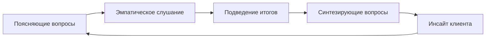

Сократический диалог в когнитивно-поведенческой терапии — это не просто набор технических приёмов. Это форма совместного исследования, в которой терапевт помогает клиенту изучить свои убеждения, оценить их достоверность и сформулировать новые, более адаптивные идеи.

## Что такое сократический диалог

Это метод **направляемого открытия**, где клиент выступает активным исследователем собственного опыта, а терапевт — его проводником (фасилитатором). Важное отличие: терапевт не знает заранее, к какому именно выводу они придут.

В отличие от чтения лекций или попыток переубедить человека силой логики, сократический диалог опирается на искреннее любопытство. Терапевт не пытается «загнать клиента в угол», чтобы доказать его неправоту, а выступает партнёром.

> **Метафора: совместное расследование**
> Процесс похож на работу детективов. Терапевт и клиент — одна команда: они вместе собирают факты (улики) из реальности, рассматривают их под разными углами и проверяют гипотезы на прочность.

## Главная цель: обучение самостоятельности

Задача диалога — не просто изменить мнение клиента здесь и сейчас, а научить его **алгоритму самопомощи**.

Этот подход развивает критическое мышление. Освоив навык оценки своих мыслей, человек постепенно становится «психотерапевтом самому себе». Это обеспечивает долгосрочный эффект и защищает от рецидивов в будущем.

Если же терапевт просто спорит с клиентом, тот может почувствовать себя непонятым или «глупым». Даже если он на словах согласится с логикой специалиста, внутренние изменения будут поверхностными, так как он не проделал эту работу сам.

## Практика: как это выглядит на сессиях

Ниже приведены примеры из клинической практики, иллюстрирующие работу сократического диалога на разных этапах.

### 1. От абстрактного обвинения к действию
*Пример Кристин Падески (работа с клиентом Стюартом).*

Когда клиент озвучивает глобальное негативное убеждение, терапевт не спорит, а переводит диалог к конкретным ситуациям.

- **Клиент:** Я полный неудачник во всех отношениях.
- **Терапевт:** Случилось что-то конкретное, что навело вас на этот вывод, или вы чувствуете себя так уже давно?
- **Клиент:** На семейном празднике я сорвался и накричал на детей...

Терапевт не утешает, а направляет внимание на ценности клиента:
- **Терапевт:** Что, по вашему мнению, сделал бы «хороший отец» в такой ситуации?
- **Клиент:** Наверное, извинился бы и объяснил, что был расстроен чем-то другим.
- **Терапевт:** Что, если бы вы попробовали вести себя так в течение недели? Как бы мы могли проверить, изменит ли это ваше самоощущение?

**В чем суть:** Терапевт не предлагал готовых ответов. Клиент сам сформулировал образ «хорошего отца» и составил план действий.

### 2. Поиск альтернативных объяснений
*Пример Джудит Бек (работа с пациентом Эйбом).*

Клиент расстроен мыслью: «Мой друг Чарли не хочет меня слышать».

- **Терапевт:** Почему вы думаете, что он не хочет вас слышать?
- **Клиент:** Мы не говорили уже месяц.
- **Терапевт:** Есть ли другой способ взглянуть на ситуацию? Почему еще он мог не выходить на связь?
- **Клиент:** У него бывают завалы на работе... Его жена иногда просит его сидеть дома. Вполне возможно, он просто слишком занят.

**В чем суть:** Вопрос об альтернативе помогает расширить фокус внимания и найти реалистичную причину, не связанную с личным отвержением.

### 3. Декатастрофизация: «Что если это правда?»
*Продолжение диалога с Эйбом.*

- **Терапевт:** Если произойдет худшее и Чарли действительно не хочет общаться, как вы с этим справитесь?
- **Клиент:** Я не буду в восторге... но у меня есть дети, внуки. Наверное, я просто буду больше общаться с другими друзьями.
- **Терапевт:** Это худший вариант. А каков самый лучший? И что, скорее всего, произойдет на самом деле?
- **Клиент:** Лучший — он сам позвонит сегодня. Реальный — он был занят и будет рад моему звонку. Что я и сделаю.

**В чем суть:** Клиент понимает, что даже «катастрофа» не смертельна, что снижает уровень тревоги.

### 4. Оспаривание правил через отвлеченные ситуации
Иногда клиенту проще оценить свое убеждение, если применить его к кому-то другому.

- **Клиент:** Просить о помощи — это признак некомпетентности и слабости.
- **Терапевт:** Представьте двух людей в депрессии. Один обращается за помощью и проходит лечение. Другой отказывается и продолжает страдать. Кто из них поступает более разумно?
- **Клиент:** Тот, кто обратился за помощью.
- **Терапевт:** А кто более компетентен в приюте: волонтер, который спрашивает инструкцию, или тот, кто делает наугад, не зная правил?
- **Клиент:** Очевидно, первый... Похоже, просить о помощи, когда она нужна — это скорее признак силы.

**В чем суть:** Смена перспективы помогает убрать эмоциональную вовлеченность и увидеть логическую ошибку в своем «жестком правиле».

### 5. Разделение мыслей и фактов
*Пример Роберта Лихи.*

- **Пациент:** Я просто знаю, что меня уволят. Все к этому идет.
- **Терапевт:** Вы в этом уверены. Но может ли случиться так, что вы ошибаетесь?
- **Пациент:** Да я почти не сомневаюсь!
- **Терапевт:** Уверенность в событии не делает само событие реальностью. Есть разница между нашими чувствами и фактами. Давайте рассмотрим доводы «за» и «против» вашего увольнения объективно?

**В чем суть:** Терапевт обучает клиента отделять субъективную «силу убеждения» от объективной реальности.

## Четыре этапа сократического диалога

Процесс движется от частных фактов к общим выводам и включает четыре шага:

1.  **Поясняющие вопросы.** Терапевт спрашивает о том, что клиент уже знает, но, возможно, не замечает. Эти вопросы переводят фокус внимания на важные детали проблемы.
2.  **Эмпатическое слушание.** Специалист внимательно следит за метафорами и эмоциональными реакциями клиента, оставаясь открытым для новой информации.
3.  **Периодическое подведение итогов.** Каждые 10–15 минут терапевт резюмирует сказанное. Это помогает убедиться, что оба участника «на одной волне», и позволяет клиенту увидеть картину целиком.
4.  **Синтезирующие вопросы.** Финальный аккорд. Терапевт просит связать новые факты с исходным убеждением. Например: *«Как эти данные соотносятся с вашей мыслью о том, что вы "полный неудачник"?»*

## Шесть категорий вопросов по Джудит Бек

Для всесторонней проверки автоматических мыслей обычно используют следующие типы вопросов:

1.  **О доказательствах:** «Что подтверждает эту мысль? А что ей противоречит?»
2.  **Об альтернативах:** «Если взглянуть иначе, какое еще объяснение может быть у этой ситуации?»
3.  **О худшем сценарии (декатастрофизация):** «Что самое страшное может случиться? Как вы с этим справитесь? Что самое хорошее может произойти? А что было бы самым реалистичным исходом?»
4.  **О влиянии мысли:** «Что с вами происходит, когда вы верите в это? Что изменится, если вы попробуете думать иначе?»
5.  **О дистанцировании:** «Что бы вы сказали близкому другу, если бы он оказался в такой же ситуации с такой же мыслью?»
6.  **О решении проблем:** «Что вы можете сделать прямо сейчас, исходя из наших выводов?»

## Отличие от спора, лекции и допроса

| Что это НЕ | Почему это важно |
| :--- | :--- |
| **Спор или дебаты** | Терапевт не доказывает правоту, а ищет истину вместе с клиентом. |
| **Лекция** | Клиент — активный создатель знания, а не пассивный слушатель. |
| **Допрос** | У терапевта нет «правильного ответа» в кармане, который он вытягивает из клиента. |
| **Прямое оспаривание** | Мысли не объявляются «ошибочными», они проверяются на достоверность. |

## Почему это работает?

1.  **Собственные выводы убедительнее.** Как отмечают Кит и Дебора Добсоны, нас гораздо сильнее меняют те слова, которые мы произнесли сами, а не те, что навязаны извне.
2.  **Стремление к когнитивному балансу.** Психолог Роберт Лихи объясняет: когда человек видит логическое противоречие в своей картине мира, он испытывает дискомфорт. Именно это внутреннее напряжение (а не давление врача) заставляет его менять свои взгляды.

## Когда метод может быть ограничен

Сократический диалог — мощный, но не универсальный инструмент.

* **Низкая интроспекция.** Если клиенту трудно наблюдать за своими мыслями, диалог может превратиться в «топтание на месте». В таких случаях уместнее использовать прямые интерпретации (объяснения со стороны терапевта).
* **Острый дистресс.** В состоянии сильного горя или боли холодная логика может восприниматься как обесценивание (*инвалидация*). Сначала нужна поддержка и принятие, а уже потом — анализ.
* **Необходимость действий.** Одной беседы часто мало. Джудит Бек подчеркивает: инсайты в кабинете нужно закреплять поведенческими экспериментами в реальной жизни.

## Резюме для практики

* **Сократический диалог** — это партнерство, а не экспертиза одного над другим.
* **Цель** — научить клиента думать критически и самостоятельно.
* **Механизм** — создание «полезного дискомфорта» через обнаружение логических нестыковок.
* **Для терапевта** — это еще и способ самопомощи: когда вы чувствуете стресс на сессии, попробуйте задать сократические вопросы самому себе.

