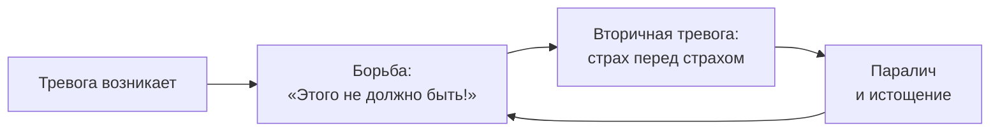

Человек просыпается в четыре утра. Сердце колотится. Он злится на себя: «Ты ничтожество, соберись, тебе нужно управлять компанией, а ты трясёшься как ребёнок». Он пытается подавить страх, но тот только растёт. Вся энергия уходит не на решение проблемы, а на войну с собственными чувствами. **Внутреннее согласие** (Inneres Ja) — техника Альфрида Лэнгле, которая останавливает эту войну и превращает тревогу из врага в союзника.

Метод показан, когда клиент застрял в невротическом сопротивлении реальности: «Этого не должно быть!», «Я обязан избавиться от этой тревоги!» Техника помогает при дезориентации, эмоциональной захваченности и кризисах идентичности.

### Почему борьба с тревогой усиливает тревогу

Экзистенциальный дефицит здесь — неспособность к **аффирмации жизни** (жизнеутверждению). В терминах Лэнгле, проблема локализуется на уровне первых двух **фундаментальных мотиваций**: «Я есть, но могу ли я быть здесь?» и «Я живу, но нравится ли мне жить?». Клиент отказывает части собственной психики (тревоге) в праве на существование.

Пока человек говорит реальности «Нет», он лишается способности к **самоотдаче** — а значит, и к чувству внутренней исполненности. Без самоотдачи нет исполненности.



### Феноменологический сдвиг: от объекта к субъекту

Активный ингредиент техники — радикальный переход от позиции объекта (терпящего насилие со стороны симптома) к позиции субъекта (свободно принимающего реальность). **Внутреннее согласие** — психологический аналог духовной свободы человека.

Тревога в экзистенциальном подходе — не враг, подлежащий уничтожению. Она естественный ориентир на пути к аутентичному существованию. Тревога сигнализирует: некая высшая ценность под угрозой. Когда клиент перестаёт бороться и говорит: «Я принимаю тебя, потому что ты защищаешь то, что мне дорого», тревога перестаёт быть демоном. Она становится советчиком.

> Человек — *Homo Patiens* (человек страдающий), и его высшая свобода заключается в выборе установки по отношению к тому страданию, которое он не в силах изменить.

### Пошаговый протокол: от факта к действию

Алгоритм требует от терапевта феноменологической открытости и готовности выдерживать паузы. Согласие нельзя навязать — оно должно созреть в духовном ядре клиента.

**Шаг 1. Феноменологическая констатация (ПЭА-0).** Терапевт останавливает борьбу с симптомом. Пример: «Вы отчаянно пытаетесь уничтожить эту тревогу. Но прямо сейчас она здесь — факт вашей внутренней жизни. Можем ли мы на минуту перестать воевать и просто позволить ей быть?»

**Шаг 2. Поиск сокрытой ценности (ПЭА-2).** Терапевт связывает тревогу с заботой о чём-то важном. Пример: «Тревога никогда не приходит в пустой дом. Она всегда охраняет сокровища. Если она кричит так громко, о какой важной ценности она заботится? Что для вас настолько дорого, что вы боитесь это потерять?»

**Шаг 3. Акт внутреннего согласия (Inneres Ja).** Терапевт помогает сформулировать осмысленное «Да» неизбежному дискомфорту. Пример: «Тревога — цена, которую мы платим за то, что нам не всё равно. Можете ли вы положить руку на грудь и сказать вслух: "Я говорю «Да» этой тревоге. Я соглашаюсь её испытывать, потому что она — часть моей заботы о будущем"?»

**Шаг 4. Переход к действию (ПЭА-3).** Пример: «Теперь, когда тревога стала союзником, какой один конкретный шаг вы сделаете сегодня, опираясь на эту заботу?»

```mermaid
graph TD
    S1["Шаг 1: Остановить борьбу<br/>Легализовать тревогу"] --> S2["Шаг 2: Найти ценность<br/>«Что тревога охраняет?»"]
    S2 --> S3["Шаг 3: Inneres Ja<br/>«Я говорю "Да" этой тревоге»"]
    S3 --> S4["Шаг 4: Действие<br/>Один конкретный шаг"]
```

### Случай Михаила: предприниматель и утренний страх

Михаил, 42 года, запускает сложный бизнес-проект. Две недели тяжёлой бессонницы и фоновый страх, парализующий способность принимать решения. Он злится на себя за «слабость».

**Михаил:** «Я ненавижу это состояние. Просыпаюсь в четыре утра, сердце колотится. Думаю: "Ты ничтожество, соберись". Пытаюсь подавить страх, но он растёт».

**Терапевт:** «Вы тратите огромные силы на войну с собой. Но этот страх — факт вашей внутренней жизни. Можем ли мы перестать воевать и позволить ему быть?»

**Михаил:** «Позволить? Да он разрушит проект! Я не могу позволить себе бояться».

**Терапевт:** «Тревога никогда не приходит в пустой дом. Если этот утренний страх кричит так громко, о какой ценности он заботится?»

**Михаил** (задумывается, дыхание замедляется): «Этот проект — дело моей жизни. Я вложил репутацию, деньги семьи. Если провалюсь, подведу людей, которые мне доверяют. Я забочусь о них».

**Терапевт:** «Значит, страх в четыре утра — не признак слабости. Это голос вашей колоссальной ответственности и заботы о близких. Любовь к ним стучится к вам в виде тревоги».

**Михаил** (на глазах слёзы): «Я никогда не думал об этом так. Я правда очень за них боюсь».

**Терапевт:** «Тревога — цена за то, что вам не всё равно. Можете ли вы сказать себе: "Я говорю «Да» этому страху в четыре утра. Я соглашаюсь испытывать тревогу, потому что она — часть моей заботы о будущем семьи"?»

**Михаил** (глубокий вздох, плечи опускаются): «Я говорю этому "Да". Я согласен не спать из-за них. Это моя забота. Я имею право за них бояться».

### Руководство для самостоятельной практики

Часто вся энергия уходит не на решение проблемы, а на войну с собственными чувствами. Настоящая свобода начинается, когда вы сознательно говорите дискомфорту «Да», понимая его скрытый смысл. Используйте этот рабочий лист в моменты сильной тревоги.

**1. Остановите войну с фактами.** Назовите происходящее без осуждения: «Прямо сейчас я испытываю сильную тревогу. Это факт моей внутренней жизни. Я прекращаю попытки силой прогнать это чувство».

**2. Найдите спрятанное сокровище.** Тревога — система сигнализации, которая кричит о потере чего-то важного. Задайте вопрос: «О чём дорогом для меня пытается позаботиться эта тревога? Какую ценность она охраняет?»

**3. Произнесите формулу согласия.** Превратите тревогу в осознанную цену: «Я говорю "Да" этой тревоге прямо сейчас. Я соглашаюсь её чувствовать, потому что она — часть моей заботы о ________».

**4. Сделайте шаг в реальность.** «Опираясь на эту ценность, какой один поступок я готов совершить в ближайшие 15 минут?»

| Этап | Ваша запись |
|---|---|
| Что я чувствую прямо сейчас | ________ |
| Какую ценность охраняет тревога | ________ |
| Формула согласия | «Я говорю "Да" этой тревоге, потому что...» |
| Один конкретный шаг | ________ |

### Противопоказания и типичные ошибки

**Противопоказания.** Метод не применяется в фазах острого шока, тяжёлой психической травматизации или при острых психозах. В состоянии шока духовное ядро человека заблокировано. Клиенту нужно базовое утешение, покой и безопасность, а не философские выборы.

**Типичное сопротивление клиента:** «Сказать "Да" тревоге — значит сдаться ей. Согласиться быть слабым!» Ответ: «Сказать "Да" — это высший акт духовной свободы. Когда вы говорите: "Я разрешаю себе тревожиться ради этой цели", вы берёте власть в свои руки. Вы больше не заложник тревоги — вы её хозяин».

**Типичная ошибка терапевта:** форсирование согласия. Внутреннее согласие — акт свободы, оно возникает только добровольно. Если клиент произносит «Да» только для того, чтобы угодить терапевту, это порождает неаутентичность. Терапевт должен позволить сомневаться.

### Три маркера истинного согласия

1. **Телесное расслабление (снятие спазма).** Глубокий спонтанный выдох, опускание плеч, изменение тона голоса на более мягкий. Исчезает спастическое напряжение гиперрефлексии.

2. **Снижение вторичной тревоги.** Клиент может испытывать базовое волнение, но полностью исчезает деструктивный «страх перед страхом». Тревога снижается до переносимого уровня и становится источником витальности.

3. **Восстановление способности действовать.** Вместо паралича нерешительности — готовность к конкретным поступкам. Внутреннее согласие открывает путь к самоотдаче: клиент готов рисковать и вкладывать силы вопреки остаточному дискомфорту.

### Заключение и Литература

Внутреннее согласие (Inneres Ja) — техника экзистенциального анализа Лэнгле, которая останавливает бесплодную войну с собственными чувствами. Терапевт помогает клиенту обнаружить ценность, стоящую за тревогой, и произнести осмысленное «Да» неизбежному дискомфорту. Тревога перестаёт быть демоном и становится советчиком. Внутреннее согласие немедленно повышает готовность к самоотдаче и возвращает человеку власть над действиями.

- Лэнгле, А. (2019). *Персональный экзистенциальный анализ*. М.: Генезис.
- Франкл, В. (1990). *Человек в поисках смысла*. М.: Прогресс.

---

**Контрольный вопрос:** Клиентка говорит: «Я согласна тревожиться» — но произносит это механически, без изменений в позе и голосе. Как вы определите, что это интеллектуальное, а не подлинное согласие, и что предпримете дальше?
