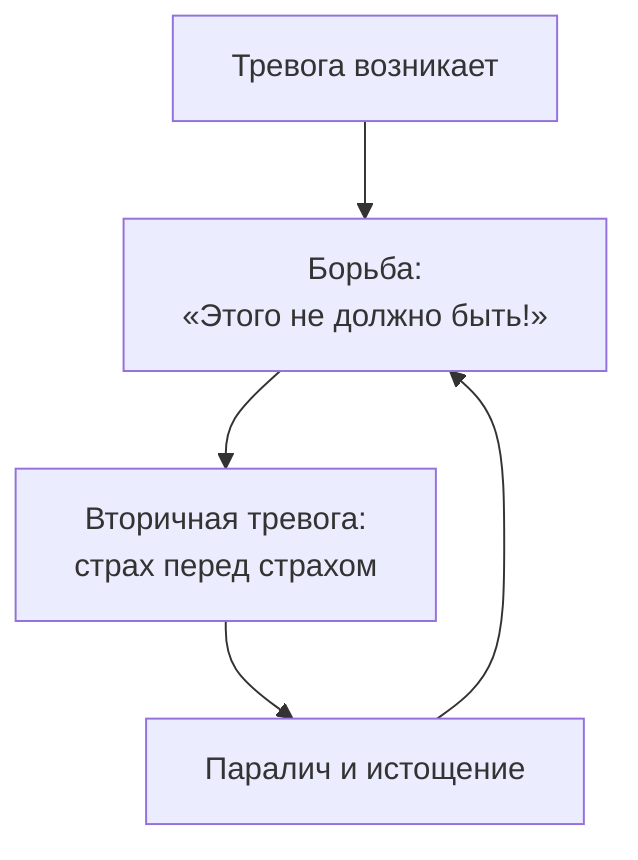
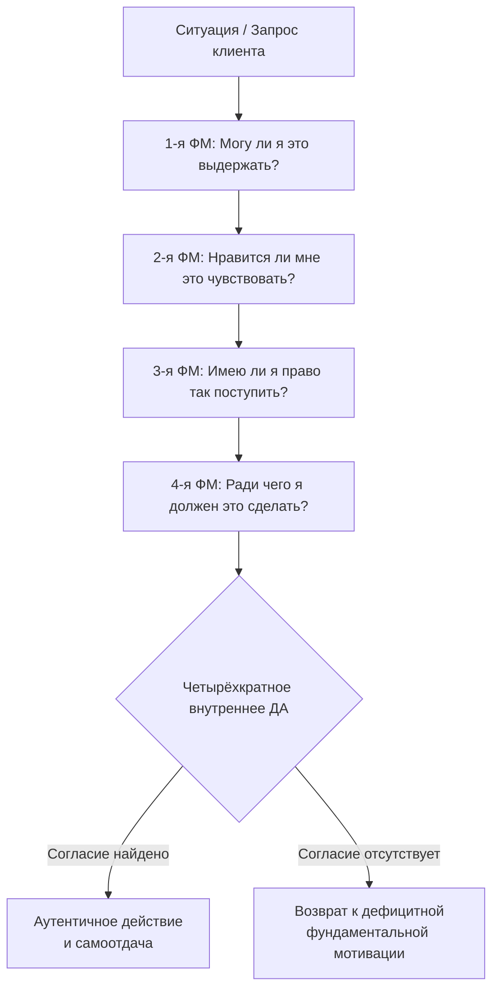

Человек просыпается в четыре утра. Сердце колотится. Он злится на себя: «Ты ничтожество, соберись, тебе нужно управлять компанией, а ты трясёшься». Он пытается подавить страх, но тот только растёт. Вся энергия уходит не на решение проблемы, а на войну с собственными чувствами.

Другой человек не может принять решение о смене работы. Он знает, что «надо», но не понимает, чего на самом деле хочет. Третий живёт из позиции долженствования — «обязан», «приходится» — и чувствует нарастающее отчуждение от собственных поступков.

**Внутреннее согласие** (Inneres Ja) — техника Альфрида Лэнгле, которая останавливает войну с собой и возвращает человеку авторство жизни *(Лэнгле, 2004)*. Она строится на последовательной активации **четырёх фундаментальных мотиваций** — уровней бытия, на каждом из которых человек должен найти своё «Да».

### Почему борьба с тревогой усиливает тревогу

Экзистенциальный дефицит здесь — неспособность к **аффирмации жизни** (жизнеутверждению). Клиент отрицает часть собственной психики — тревогу, дискомфорт, сомнение — и тем самым лишается способности к **самоотдаче**. Без самоотдачи нет исполненности.

Пока человек говорит реальности «Нет», он блокирует контакт с собственными ценностями. Тревога в экзистенциальном подходе — не враг, подлежащий уничтожению. Она сигнализирует: некая высшая ценность под угрозой.

> Человек — *Homo Patiens* (человек страдающий), и его высшая свобода заключается в выборе установки по отношению к тому страданию, которое он не в силах изменить.

### Четырёхкратное согласие: архитектура внутреннего «Да»

Лэнгле описывает аутентичную жизнь как состояние, в котором человек способен ответить «Да» на каждом из четырёх уровней бытия *(Лэнгле, 2004)*. Экзистировать означает мочь, нравиться, иметь право и быть ответственным одновременно.

| Мотивация | Ключевой вопрос | Что необходимо | Дефицит приводит к |
| :--- | :--- | :--- | :--- |
| **1-я ФМ — мир** | Могу ли я быть в этих условиях? | Пространство, защита, опора | Базисной тревоге |
| **2-я ФМ — жизнь** | Нравится ли мне жить? | Близость, тепло, отношения | Депрессии |
| **3-я ФМ — личность** | Имею ли я право быть собой? | Уважение, справедливость, признание | Отчуждению от «я» |
| **4-я ФМ — смысл** | Ради чего я здесь? | Деятельность, смысловые связи, ценности | Экзистенциальному вакууму |

Механизм техники — достижение радикального феноменологического сдвига. Терапевт переводит клиента из пассивного претерпевания в активную позицию жизнеутверждения *(Лэнгле, 2004)*.

### Пошаговый диагностический протокол

Протокол требует от терапевта феноменологической открытости. Терапевт не даёт советов — он выступает катализатором, помогающим клиенту услышать собственный внутренний голос.

**Шаг 1. Диагностика 1-й ФМ: «Могу ли я быть?»** Терапевт исследует фактические условия жизни клиента. Он ищет пространство, защиту и опору. Скрипт: «Давайте посмотрим на голые факты ситуации. Можете ли вы физически и духовно выдержать эти условия? Есть ли у вас безопасное пространство и опора, на которую можно положиться прямо сейчас?»

**Шаг 2. Диагностика 2-й ФМ: «Нравится ли мне жить?»** Терапевт обращается к эмоциональности и ценностям переживания. Он ищет тепло, близость и отношения. Скрипт: «Вы выдерживаете эту ситуацию, но нравится ли вам так жить? Приносит ли этот выбор вам радость или хотя бы чувство внутренней правильности? Есть ли здесь ценности, ради которых вам хочется просыпаться?»

**Шаг 3. Диагностика 3-й ФМ: «Имею ли я право быть собой?»** Терапевт работает с аутентичностью и совестью. Скрипт: «Посмотрите на себя со стороны. Имеете ли вы право поступать именно так? Можете ли вы внутренне стоять за это решение, не предавая свою уникальность? Справедливо ли это по отношению к вам самим?»

**Шаг 4. Диагностика 4-й ФМ: «Ради чего большего?»** Терапевт выводит клиента в сферу смыслов и ценностей будущего. Скрипт: «Ради кого или ради чего вы готовы вложить труд в эту ситуацию? Если вы сделаете этот шаг, что ценного придёт в мир? В чём заключается требование именно этого часа к вам лично?»

**Финальный шаг — акт внутреннего согласия.** Если хотя бы на одном уровне звучит «Нет», клиент возвращается к этой мотивации. Когда все четыре уровня дают «Да» — разрозненные импульсы сливаются в единую аутентичную волю *(Лэнгле, 2004)*.

### Кейсы: три примера из практики

**Кейс 1. Бетти и депрессия чужой жизни.** Пациентка 27 лет страдала от тяжёлой депрессии и панических атак после смерти отца. Отец всю жизнь требовал полного подчинения — заставил бросить искусство и учиться на медицинском факультете. Она покупала лошадей, меняла наряды, но чувствовала полную пустоту. Терапевт проанализировал жизнь Бетти через призму четырёх мотиваций. Опора в виде денег была (1-я ФМ), суррогатные удовольствия — тоже (2-я ФМ). Дефицит обнаружился в 3-й ФМ: даёт ли Бетти *личное внутреннее согласие* на изучение медицины? Или это решение принадлежит умершему отцу? Осознав отчуждённость, Бетти приняла решение бросить нелюбимую профессию. Панические атаки исчезли. Она жила чужими целями — и это лишало её права быть собой *(Лэнгле, 2004)*.

**Кейс 2. Мужчина и несогласованные выходные.** Клиент злился на жену из-за постоянных ссор: она регулярно приглашала друзей на выходные, ставя его перед фактом. Терапевт обнаружил: мужчине хватает пространства (1-я ФМ), он ценит социальную жизнь жены (4-я ФМ), но остро переживает дефицит справедливости (3-я ФМ). Через протокол клиент сформулировал своё «Да»: он хочет, чтобы жена имела социальную жизнь — и он также имеет право на то, чтобы его информировали заранее. Вместо скандала клиент написал жене спокойное письмо с объяснением своих чувств и предложением компромисса. Ссоры прекратились *(Лэнгле, 2004)*.

**Кейс 3. Мастер педикюра и дилемма переезда.** Женщина-мастер страдала от нерешительности: хотела переехать в светлое просторное помещение (1-я ФМ — пространство), но боялась потерять старых клиентов (2-я ФМ — отношения). Терапевт объяснил «четыре боли выбора»: выбрать одно — значит «убить» другое. Какая ценность перевешивает? Способна ли она сказать твёрдое «Да» светлым кабинетам и принять потерю клиентов как цену за свой комфорт? Женщина осознала, что комфорт на рабочем месте сейчас важнее. Тоска по старым клиентам осталась, но перестала быть мучительной — жертва была принесена добровольно *(Лэнгле, 2004)*. Когда воля опирается на найденный смысл, человек способен выдерживать оборотную сторону выбора без невротических сожалений.

### Случай Михаила: тревога и внутреннее согласие

Михаил, 42 года, запускает сложный бизнес-проект. Две недели тяжёлой бессонницы и фоновый страх, парализующий принятие решений.

**Михаил:** «Я ненавижу это состояние. Просыпаюсь в четыре утра, сердце колотится. Думаю: "Ты ничтожество, соберись". Пытаюсь подавить страх, но он растёт».

**Терапевт:** «Вы тратите огромные силы на войну с собой. Но этот страх — факт вашей внутренней жизни. Можем ли мы перестать воевать и позволить ему быть?»

**Михаил:** «Позволить? Он разрушит проект!»

**Терапевт:** «Тревога никогда не приходит в пустой дом. Если этот утренний страх кричит так громко — о какой ценности он заботится?»

**Михаил** (задумывается): «Этот проект — дело моей жизни. Я вложил репутацию, деньги семьи. Я забочусь о них».

**Терапевт:** «Значит, страх в четыре утра — не слабость. Это голос вашей колоссальной ответственности и заботы о близких. Можете ли вы сказать: "Я говорю «Да» этой тревоге. Я соглашаюсь её испытывать, потому что она — часть моей заботы о будущем семьи"?»

**Михаил** (глубокий вздох, плечи опускаются): «Я говорю этому "Да". Я согласен не спать из-за них. Это моя забота».

### Руководство для самостоятельной работы: четыре координаты

Возьмите лист бумаги. Вспомните актуальную ситуацию, где вы не можете принять решение. Задайте себе четыре жёстких вопроса.

| Координата | Вопрос |
| :--- | :--- |
| **1. Опоры** | Достаточно ли у меня сил, времени и денег, чтобы выдержать последствия этого решения? Есть ли надёжный тыл? |
| **2. Жизни** | Если я сделаю это — будет ли в моей жизни больше радости? Делаю ли я это из любви к процессу или только из страха? |
| **3. Личности** | Если я соглашусь — не предам ли самого себя? Буду ли уважать себя завтра утром, посмотрев в зеркало? |
| **4. Смысла** | Ради кого или ради чего я готов терпеть неудобства этого решения? Делает ли этот выбор мир хотя бы немного лучше? |

Если вы ответили искренним «Да» на все четыре вопроса — действуйте немедленно. Если на каком-либо уровне звучит «Нет» — остановитесь. Это сигнал о том, что решение пока не созрело *(Лэнгле, 2004)*.

### Противопоказания и типичные ошибки

**Противопоказания.** Метод не применяется в фазах острого шока, тяжёлой психической травматизации или при острых психозах. В состоянии шока духовное ядро человека заблокировано. Клиенту нужны базовое утешение, покой и безопасность — а не философские выборы.

**Типичное сопротивление:** «Это слишком абстрактно. Скажите мне просто: разводиться мне или нет?» Ответ терапевта: «Конкретный совет не сработает без внутреннего фундамента. Я не знаю, как вам лучше жить. Мы сейчас ищем не готовое решение, а восстанавливаем вашу способность быть автором жизни. Пока вы сами не скажете "Да" одному из вариантов, любой мой совет сделает вас марионеткой» *(Лэнгле, 2004)*.

**Ошибка терапевта: морализаторство.** Терапевт не выступает священником и не навязывает клиенту свой смысл. Если терапевт убеждает клиента принять конкретное решение — он совершает насилие над духовным ядром пациента. Смысл не выдумывается и не даётся извне — он открывается самим человеком.

**Ошибка: форсирование согласия.** Внутреннее согласие — акт свободы. Если клиент произносит «Да» только для того, чтобы угодить терапевту, это порождает неаутентичность. Терапевт должен позволить сомневаться.

### Три маркера истинного согласия

1. **Смена лексического регистра.** Пассивные конструкции («меня заставили», «приходится») исчезают из речи. Появляются активные глаголы воли: «я выбираю», «я отказываюсь», «я готов заплатить эту цену».
2. **«Вторая самоочевидность».** Мучительные сомнения сменяются спокойной ясностью. Клиент ощущает, что найденное решение — единственно верное для него в данный момент.
3. **Телесное заземление.** Спастическое напряжение и поверхностное дыхание сменяются глубоким спонтанным выдохом и расслаблением. Тело подтверждает обретение опоры.

### Заключение и Литература

Inneres Ja — техника экзистенциального анализа Лэнгле, которая превращает бесплодную войну с собственными чувствами в четырёхкратный диалог с уровнями бытия. Терапевт последовательно помогает клиенту найти «Да» на каждом из четырёх уровней: могу быть, нравится жить, имею право быть собой, понимаю, ради чего. Когда все четыре уровня дают согласие — разрозненные импульсы сливаются в единую аутентичную волю, а самоотдача становится возможной.

- Лэнгле, А. (2004). *Основы экзистенциального анализа*.
- Лукас, Э. (2019). *Учебник логотерапии. Представление о человеке и методы*. Московский институт психоанализа.
- Франкл, В. (1990). *Человек в поисках смысла*. М.: Прогресс.

---

**Контрольный вопрос:** Клиент рассматривает смену работы. Зарплата на новом месте значительно ниже, но работа интереснее. Он говорит: «Хочу уйти, но боюсь финансовой нестабильности». На каком из четырёх уровней обнаруживается дефицит в первую очередь? Составьте для него один диагностический вопрос по каждой из четырёх фундаментальных мотиваций — и объясните, что «сигнал "Нет"» на уровне 1-й ФМ означает для дальнейшей работы.
