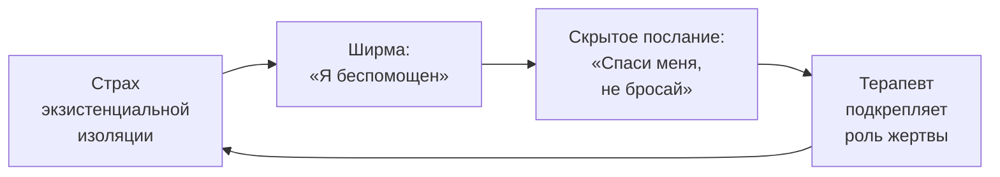
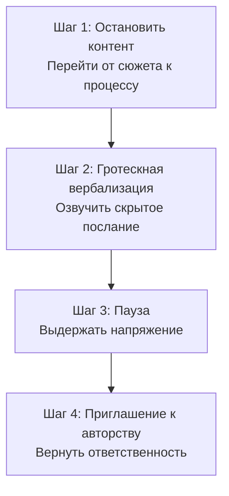

Клиент жалуется тихим, плаксивым голосом. Он рассказывает о своих бедах, но терапевт чувствует странное несоответствие: слова говорят о боли, а процесс «здесь и сейчас» говорит о чём-то другом. За фасадом беспомощности скрывается неосознанное послание: «Посмотри, какой я жалкий — может, тогда ты меня не бросишь?» Техника **«Выглядывание из-за ширмы»** (Дж. Бьюдженталь) разоблачает это скрытое послание и возвращает клиенту авторство над собственной жизнью.

Метод применяется, когда клиент находится в состоянии неаутентичного присутствия и использует «жалобу» как инструмент межличностного давления. Требует прочного терапевтического альянса.

### Ширма беспомощности: как жертва становится режиссёром

Экзистенциальный дефицит здесь — **избегание ответственности и свободы**. Клиент отказывается признавать, что он сам является автором своей жизни и реакций. Прикрываясь фасадом слабости («ширмой»), он пытается избежать ужаса **экзистенциальной изоляции**.

Сливаясь с ролью невинно страдающего, пациент перекладывает ответственность за спасение на плечи терапевта. В логотерапевтических терминах это отказ от позиции *Homo Patiens* — человека страдающего, но духовно свободного. Клиент добровольно низводит себя до уровня сломанного механизма, нуждающегося во внешней починке.

### Радикальное обнажение процесса: активный ингредиент

Бьюдженталь заметил: клиент невербально (позой, тоном, уходом от темы) ярко демонстрирует свои намерения, но совершенно не осознаёт их. Терапевт осуществляет **феноменологическую редукцию**: выносит «за скобки» сюжет жалобы и обращает внимание на живой феномен — на то, что происходит *между* ними в данную секунду.

Гротескная, но точная вербализация — «Мне кажется, вы сейчас говорите мне: "Посмотри, какая я жалкая..."» — работает как шоковая терапия для сопротивления. Это не психоаналитическая интерпретация прошлого. Это **экзистенциальная конфронтация**: терапевт озвучивает скрытое послание клиента, вытаскивая его из тени. Разоблачая манипуляцию, терапевт апеллирует к здоровому, свободному ядру клиента, предполагая, что тот способен выдержать правду.

### Пошаговый протокол: от контента к процессу

Протокол требует от терапевта максимального присутствия и готовности выдержать всплеск гнева.

**Шаг 1. Остановка контента.** Терапевт прекращает следовать за бесконечным сюжетом жалоб, распознав за ними давление. Пример: «Подождите минуту. Вы рассказываете о бедах, но я слышу в голосе и вижу в позе нечто иное — то, что происходит прямо сейчас между нами».

**Шаг 2. Выглядывание из-за ширмы (гротескная вербализация).** Терапевт озвучивает скрытое послание в слегка преувеличенной, но эмоционально точной форме. Пример: «Мне кажется, вы сейчас всем видом говорите мне: "Посмотри, какая я жалкая и несчастная, может, хоть тогда ты меня пожалеешь и не бросишь?"»

**Шаг 3. Выдерживание паузы.** Терапевт замолкает. Не смягчает, не извиняется. Пауза создаёт невыносимое экзистенциальное напряжение, в котором сгорает старая защита.

**Шаг 4. Приглашение к авторству.** После реакции клиента (гнев, шок, слёзы) терапевт помогает ассимилировать инсайт. Пример: «Я вижу, что мои слова задели вас. Но посмотрите на то, что вы делали секунду назад. Вы использовали боль, чтобы привязать меня к себе. Можете ли вы взять на себя ответственность за это желание прямо сейчас?»

### Случай Елены: «Я безнадёжна, правда?»

Елена, 38 лет. Жалобы на хроническое одиночество и неудачи на работе. В терапии занимает пассивную позицию, демонстрирует хрупкость и буквально «вытягивает» из терапевта советы и сочувствие.

**Елена** (тихо, глядя в пол): «Начальник снова отдал проект другому. Я даже не стала спорить. Какой смысл? Я так устала быть пустым местом. Я безнадёжна, правда? Вы, наверное, устали от меня».

**Терапевт:** «Елена, остановитесь. Я вслушиваюсь не только в то, *что* вы рассказываете, но и в то, *как* вы общаетесь со мной. Мне кажется, вы сейчас всем видом говорите: "Посмотри, какая я жалкая, никчемная и несчастная, может, тогда ты меня пожалеешь и не бросишь?"»

**Елена** (краснеет, шок сменяется гневом): «Это жестоко! Я рассказываю о боли, а вы издеваетесь! Вы такой же бессердечный, как все!»

**Терапевт:** «Вы очень злитесь на меня. И посмотрите: куда подевалась та "безнадёжная, неприспособленная" девочка, которая была здесь минуту назад? Сейчас вы звучите сильно и твёрдо».

**Елена** (замешательство сменяет гнев, выпрямляет спину): «Я просто не ожидала. Я думала, вы меня отвергаете».

**Терапевт:** «Вы боитесь: если не будете демонстрировать свои раны, я потеряю интерес и брошу вас».

**Елена** (тихо плачет, но искренне): «Но если я сильная, кому я буду нужна? Если справлюсь сама, вы скажете, что терапия окончена».

**Терапевт:** «Вы используете слабость, чтобы гарантировать, что я останусь. Но цена — ваша собственная жизнь. Вы платите за иллюзию безопасности своей карьерой и достоинством».

За фасадом беспомощности обнаружился подлинный страх — страх экзистенциальной изоляции. Теперь терапия может работать с настоящей проблемой.

### Руководство для самостоятельной практики

Иногда за слезами и жалобами скрывается неосознанный мотив: использовать слабость как щит и оружие. Чтобы вернуть силу, нужно набраться мужества и заглянуть за собственную ширму.

**Шаг 1. Поймайте себя на жалобе.** Заметили, что жалуетесь, используя слова «я не могу», «у меня никогда не получится», «я просто такой»? Остановитесь.

**Шаг 2. Задайте «жёсткий» вопрос.** Спросите себе предельно честно: «Если бы я озвучил своё самое эгоистичное, тайное требование к этому человеку, как бы оно звучало?»

| Что я говорю вслух | Что я на самом деле хочу |
|---|---|
| «Мне так плохо, я не справляюсь» | «Я хочу, чтобы ты всё бросил и решал мои проблемы» |
| «Я безнадёжен» | «Посмотри, какой я жалкий — теперь ты не имеешь права уйти» |
| «Всем плевать на меня» | «Я хочу, чтобы ты чувствовал себя виноватым» |

**Шаг 3. Произнесите это вслух.** Наедине с собой скажите честную фразу. Заметьте парадокс: осознание манипуляции мгновенно возвращает чувство силы. Тот, кто *выбрал* роль жертвы, волен её изменить.

**Шаг 4. Сделайте прямой запрос.** Вместо демонстрации страданий попробуйте попросить о близости напрямую: «Мне сейчас страшно и одиноко, побудь со мной» вместо «Я умираю, а всем плевать».

### Противопоказания и типичные ошибки

**Абсолютные противопоказания:**
1. **Первые сессии** без прочного терапевтического альянса. Без запаса доверия клиент воспримет конфронтацию как оскорбление и уйдёт.
2. **Острые стадии горя или утраты.** Слабость и боль клиента — естественная реакция на катастрофу, а не манипуляция.
3. **Пограничные состояния в декомпенсации, психозы, тяжёлые меланхолические депрессии** с суицидальным риском.

**Типичное сопротивление клиента:** «Вы передёргиваете! Вы холодный и бесчувственный, раз видите манипуляцию в моей боли!» Ответ: «Ваша боль абсолютно реальна, и я сочувствую ей. Но я вижу, как она используется как инструмент. Моя забота — помочь вам стать сильным, даже если сейчас вы злитесь».

**Типичная ошибка терапевта:** морализаторство вместо феноменологии. Неопытный терапевт использует технику как дубинку: «Вы просто манипулируете мной!» Экзистенциальный терапевт не обвиняет — он освещает слепое пятно. Обнажение мотива подаётся не с гневом, а с глубоким уважением и верой в способность клиента выдержать правду.

### Четыре маркера обретённого авторства

1. **Смена лексического регистра.** Клиент переходит от безличных оборотов («На меня навалилась тоска», «Так вышло») к присвоению действий: «Я сам оттолкнул её», «Я снова пытаюсь заставить вас решать за меня».

2. **Феномен самокоррекции.** Клиент начинает сеанс с привычного нытья, но останавливается и говорит: «Я опять это делаю. Опять пытаюсь выдавить из вас жалость». Способность к самоиронии — признак разрушения невротической защиты.

3. **Восстановление телесной витальности.** Инфантильный, прерывистый голос сменяется полнозвучным взрослым тембром. Выравнивается осанка. Клиент перестаёт играть роль и становится подлинно присутствующим.

4. **Прямые запросы вместо манипуляций.** Клиент учится просить о близости напрямую, без демонстрации ран.

### Заключение и Литература

«Выглядывание из-за ширмы» — техника экзистенциальной конфронтации Бьюдженталя, которая обнажает скрытое послание клиента и возвращает ему ответственность за собственное поведение. Терапевт переключается с контента (сюжета жалобы) на процесс (то, что происходит между ними «здесь и сейчас») и озвучивает манипулятивное послание в слегка преувеличенной, но точной форме. Шок разоблачения апеллирует к здоровому, свободному ядру клиента. Метод требует прочного альянса и глубокого уважения. Противопоказан на первых сессиях, при остром горе и психотических состояниях.

- Бьюдженталь, Дж. (2020). *Наука быть живым*. М.: Класс.
- Ялом, И. (2020). *Экзистенциальная психотерапия*. М.: Класс.
- Франкл, В. (1990). *Человек в поисках смысла*. М.: Прогресс.

---

**Контрольный вопрос:** Клиент на пятой сессии жалуется: «Вы единственный, кто меня понимает. Без вас я пропаду». Как вы определите, является ли это подлинным выражением чувств или манипулятивной ширмой, и какую формулировку используете на шаге 2?
