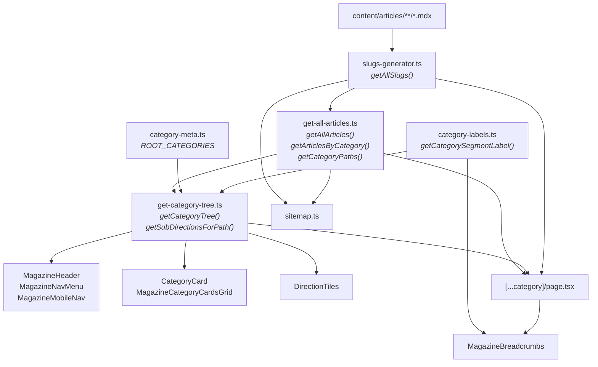

# Как устроены статьи в журнале

Документ описывает полный жизненный цикл статьи — от файла `.mdx` на диске до отображения
в навигации, хлебных крошках, карточках категорий и sitemap.

---

## Оглавление

1. [Общая архитектура](#1-общая-архитектура)
2. [Откуда берётся путь статьи и что из него извлекается](#2-откуда-берётся-путь-статьи-и-что-из-него-извлекается)
3. [Роль `category` в frontmatter](#3-роль-category-в-frontmatter)
4. [Потоки данных: навигация, крошки, карточки, sitemap](#4-потоки-данных-навигация-крошки-карточки-sitemap)
5. [Чеклист: добавление новой папки со статьями](#5-чеклист-добавление-новой-папки-со-статьями)
6. [Карта файлов и зависимостей](#6-карта-файлов-и-зависимостей)

---

## 1. Общая архитектура

```
content/articles/               ← файлы .mdx (единственный источник контента)
  psychology/
    cbt/
      my-article.mdx
    clinical/
      another-article.mdx
  philosophy/
    buddhism/
      four-noble-truths.mdx

features/magazine/lib/          ← серверная логика (сбор slug'ов, дерево категорий, подписи)
features/magazine/components/   ← React-компоненты (крошки, карточки, навигация)
app/magazine/                   ← Next.js App Router маршруты
```

Приложение — Next.js (App Router). Все страницы журнала живут под маршрутом `/magazine`.
Один catch-all роут `app/magazine/(categories)/[...category]/page.tsx` обслуживает и
отдельные статьи, и листинги по категориям.

---

## 2. Откуда берётся путь статьи и что из него извлекается

### 2.1 Путь файла → slug

Модуль `features/magazine/lib/slugs-generator.ts` рекурсивно обходит `content/articles/`
и для каждого `.mdx` строит массив сегментов пути **без расширения**:

```
content/articles/psychology/cbt/my-article.mdx
                 ↓
["psychology", "cbt", "my-article"]   ← ArticleSlugSegments
```

Этот массив — «slug» статьи. Из него строится:

| Что                     | Формула                                              | Пример                                        |
|--------------------------|------------------------------------------------------|-----------------------------------------------|
| URL страницы             | `/magazine/${slug.join('/')}`                        | `/magazine/psychology/cbt/my-article`         |
| Импорт MDX               | `` `@/content/articles/${slug.join('/')}.mdx` ``    | `@/content/articles/psychology/cbt/my-article.mdx` |
| Ключ для дедупликации    | `slug.join('/')`                                     | `psychology/cbt/my-article`                   |

### 2.2 Что именно извлекается из пути

Путь файла — это не просто адрес. Каждый промежуточный каталог становится **сегментом
категории** и используется для:

- построения навигации (меню, карточки);
- хлебных крошек (каждый каталог — звено);
- фильтрации статей по префиксу;
- генерации страниц категорий (`/magazine/psychology`, `/magazine/psychology/cbt`).

Последний сегмент — имя `.mdx`-файла без расширения — это slug самой статьи.
Всё остальное перед ним — цепочка вложенных категорий.

---

## 3. Роль `category` в frontmatter

Каждый `.mdx` содержит в YAML frontmatter поле `category` — массив строк:

```yaml
category:
  - philosophy
  - buddhism
```

### 3.1 Зачем `category` нужен, если путь файла уже содержит те же сегменты?

Путь файла используется только на этапе сборки (`slugs-generator.ts`, `generateStaticParams`).
А `category` — это **данные, доступные в runtime** (через `frontmatter` при `import(...).mdx`).

Модуль `get-all-articles.ts` читает `frontmatter.category` и на его основе:

1. **Фильтрует статьи по разделу** (`getArticlesByCategory`) — показывает все статьи,
   у которых `category` начинается с переданного префикса.
2. **Считает число статей в каждом направлении** (`directionsForArticles` в `get-category-tree.ts`) —
   берёт `category[parentPath.length]` (следующий сегмент после префикса) и агрегирует счётчики.
3. **Подбирает похожие статьи** (`getRelatedArticles`) — сравнивает цепочки `category`
   по совпадению префикса и пересечению сегментов.

### 3.2 Контракт

> **`category` в frontmatter обязан совпадать с путём каталогов файла (без имени `.mdx`-файла).**

Файл `content/articles/psychology/cbt/my-article.mdx` должен содержать:

```yaml
category:
  - psychology
  - cbt
```

Если `category` не совпадает с путём:
- статья может не появиться в листинге нужного раздела;
- крошки покажут правильные папки (из URL), но счётчик статей в карточках будет считать
  по `category` — возникнет рассогласование;
- `getRelatedArticles` не свяжет статью с нужным разделом.

---

## 4. Потоки данных: навигация, крошки, карточки, sitemap

### 4.1 Навигация (шапка)

```
app/layout.tsx
  └── getCategoryTree()                          ← дерево корневых разделов с направлениями
       └── MagazineHeader
            ├── MagazineNavMenu      (десктоп)   ← выпадающее меню с колонками
            └── MagazineMobileNav    (мобайл)    ← Sheet + Accordion
```

`getCategoryTree()` берёт корневые slug'и из `CATEGORY_ORDER` (`category-meta.ts`), для
каждого считает дочерние направления через `directionsForArticles` (по `frontmatter.category`
всех статей), и фильтрует разделы без материалов.

**Важно:** навигация показывает только **один уровень вглубь** от корня (например
`psychology → cbt, clinical, …`). Более глубокие уровни (`cbt → techniques`) доступны
через `DirectionTiles` на странице категории.

Подписи сегментов в меню берутся из `getCategorySegmentLabel` (`category-labels.ts`):
сначала ищет slug в словаре `LABELS`, потом в `ROOT_LABELS`, иначе — Title Case из slug'а.

### 4.2 Хлебные крошки

```
MagazineBreadcrumbs(categorySegments, currentLabel, articleMode)
```

Компонент рендерится **на каждой странице отдельно** (не в layout), потому что ему нужны
`params` роута и данные frontmatter.

| Страница          | `categorySegments`        | `currentLabel`           | `articleMode` |
|--------------------|---------------------------|--------------------------|---------------|
| `/magazine`        | `[]`                      | `'Статьи'`              | `false`       |
| `/magazine/psychology/cbt` | `['psychology', 'cbt']` | `getCategoryTitle(…)` → `'КПТ'` | `false` |
| `/magazine/psychology/cbt/my-article` | `['psychology', 'cbt']` | `frontmatter.title` | `true` |

Логика внутри:

- **Индекс** (`categorySegments=[]`, `articleMode=false`): `Главная → Статьи` (текущая страница).
- **Категория** (`articleMode=false`): `Главная → Статьи → Psychology → CBT` — все сегменты кроме
  последнего ведут ссылкой, последний — текущая страница.
- **Статья** (`articleMode=true`): `Главная → Статьи → Psychology → CBT → Заголовок статьи` —
  все `categorySegments` — ссылки, `currentLabel` — текущая страница.

Подписи для slug'ов берутся из `getCategorySegmentLabel`. Если slug не прописан
в словаре, получится fallback: Title Case по дефисам.

### 4.3 Карточки категорий и направления

#### Витрина `/magazine`

```
MagazineShowcase
  └── getCategoryTree()
       └── MagazineCategoryCardsGrid
            └── CategoryCard (для каждого корневого раздела)
                 ├── category.label, category.description
                 ├── category.totalArticleCount
                 └── Badge для каждого direction (label + articleCount)
```

Карточка показывает до 5 направлений, отсортированных по убыванию `articleCount`,
с кнопкой «+ ещё N».

#### Страница категории с подразделами

```
[...category]/page.tsx
  └── getSubDirectionsForPath(segments)
       └── DirectionTiles
            └── Card для каждого дочернего направления (label + articleCount)
```

Если `getSubDirectionsForPath` возвращает непустой список, страница показывает плитки
направлений над списком статей.

### 4.4 Sitemap

`app/sitemap.ts` собирает URL из трёх источников:

1. Статика: `/`, `/magazine`.
2. Категории: все префиксы из `getCategoryPaths()`, кроме тех, что совпадают со slug'ом статьи.
3. Статьи: каждый slug из `getAllSlugs()`.

---

## 5. Чеклист: добавление новой папки со статьями

Допустим, мы добавляем новый корневой раздел `neuroscience` или новое направление
`psychology/act`.

### Шаг 1. Создать каталог и `.mdx`

```
content/articles/psychology/act/
  acceptance-and-commitment-therapy.mdx
```

### Шаг 2. Заполнить frontmatter

```yaml
---
title: Терапия принятия и ответственности
description: Обзор ACT как подхода третьей волны КПТ.
date: '2026-03-21'
tags:
  - ACT
  - Психотерапия
category:
  - psychology
  - act           # ← должно совпадать с путём каталогов
---
```

**Если `category` не совпадёт с путём каталога** — статья не появится в нужном разделе
карточек и навигации (см. раздел 3.2).

### Шаг 3. Добавить подпись slug'а в `category-labels.ts`

Откройте `features/magazine/lib/category-labels.ts` и допишите в словарь `LABELS`:

```ts
act: 'Терапия принятия и ответственности',
```

Без этого: в хлебных крошках, навигации и карточках будет показан fallback `Act`
(Title Case), а не полное название.

### Шаг 4 (только для нового **корневого** раздела). Обновить `category-meta.ts`

Если добавляется не подраздел, а новый корневой раздел (например `neuroscience`):

1. Добавьте запись в массив `ROOT_CATEGORIES` в `features/magazine/lib/category-meta.ts`:

   ```ts
   {
     slug: 'neuroscience',
     label: 'Нейронаука',
     description: 'Как работает мозг и что это значит для практики.',
   },
   ```

2. Порядок элементов в массиве определяет порядок на витрине и в навигации.
3. `CATEGORY_ORDER` и `CATEGORIES_META` генерируются автоматически из `ROOT_CATEGORIES`.

### Шаг 5. Проверить результат

Запустите dev-сервер (`npm run dev`) и проверьте:

| Что проверить                   | Где смотреть                                |
|---------------------------------|---------------------------------------------|
| Навигация (десктоп и мобайл)    | Шапка → выпадающее меню / Sheet             |
| Хлебные крошки                  | Страница статьи и страница категории        |
| Карточка категории              | `/magazine` (витрина)                       |
| Плитки направлений              | `/magazine/psychology` (если есть дочерние) |
| Счётчики статей                 | В карточках и плитках                       |
| Sitemap                         | `/sitemap.xml`                              |
| Подписи (не fallback Title Case)| Крошки, меню, карточки                      |

---

## 6. Карта файлов и зависимостей



| Файл | Ответственность |
|------|-----------------|
| `slugs-generator.ts` | Сбор slug'ов из файловой системы (build / SSR) |
| `get-all-articles.ts` | Загрузка frontmatter, фильтрация по категории, подбор похожих |
| `get-category-tree.ts` | Дерево разделов: корни + дочерние направления со счётчиками |
| `category-meta.ts` | Ручные метаданные корневых разделов и их порядок |
| `category-labels.ts` | Подписи slug'ов для UI (крошки, меню, карточки) |
| `magazine-path.ts` | Утилита: массив сегментов → `/magazine/...` href |
| `magazine-breadcrumbs.tsx` | Хлебные крошки (рендерится на каждой странице) |
| `magazine-nav-menu.tsx` | Десктопное выпадающее меню |
| `magazine-mobile-nav.tsx` | Мобильная навигация (Sheet + Accordion) |
| `category-card.tsx` | Карточка корневого раздела с направлениями |
| `direction-tiles.tsx` | Плитки дочерних направлений на странице категории |
| `[...category]/page.tsx` | Catch-all роут: статья или листинг |
| `sitemap.ts` | Карта сайта для поисковиков |
